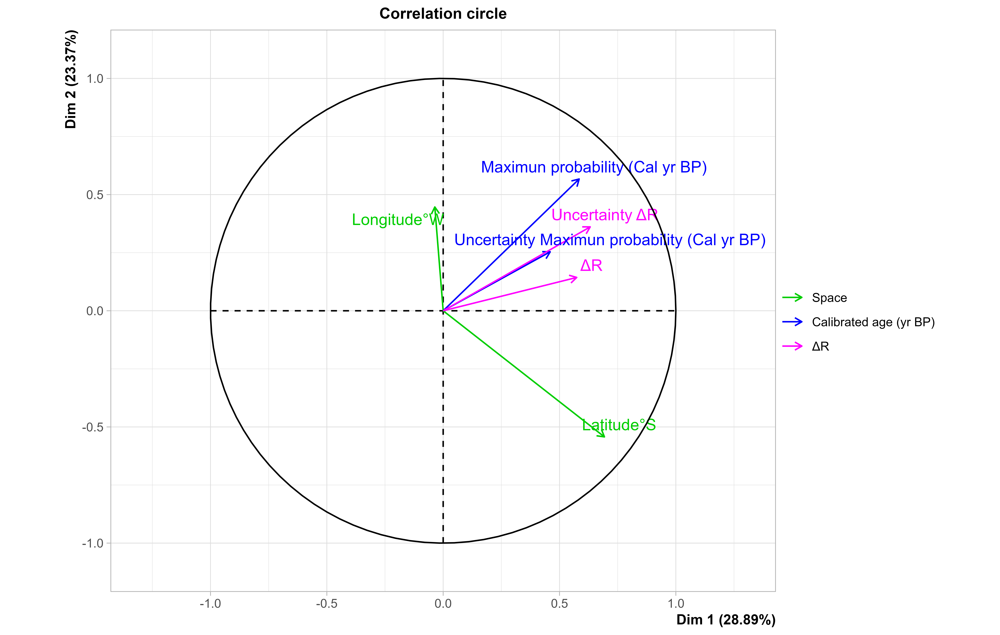

---
output:
  html_document: default
  pdf_document: default
---

# New estimations of $\Delta R$ for the South-eastern Pacific obtained from Marine20

## Contents

-   [Abstract](#abstract)
-   [Introduction](#introduction)
-   [Materials and methods](#materials-and-methods)
-   [Principal outcomes](#principal-outcomes)
-   [Discussion](##discussion)
-   [Conclusions](#conclusions)
-   [References](#references)
-   [R code](#r-code)

## Abstract
Radiocarbon ($^{14}C$ ) is a cosmogenic radionuclide produced in the upper atmosphere that is frequently used in paleoceanography to date sediment cores. However, dating marine sediment records has an important particularity: contemporaneous terrestrial and marine organisms have different $^{14}C$  ages because the ocean is a source of $^{14}C$ . Therefore, marine organisms appear to be older than contemporaneous terrestrial organisms. This effect is called the marine reservoir effect (MRE) and it varies in space and time as a function of changes in water mass origin and circulation.

In the particular case of the coasts of Peru and Chile, MRE could be due to the intensity of upwelling and the origin of the upwelled waters. Therefore, it needs to be considered when dating marine sediment cores from these regions. Recently, an internationally agreed-upon marine radiocarbon age calibration curve (Marine20) was released, which provides a global average marine record of radiocarbon from 0 to 55 cal kyr BP. This curve serves as a baseline for regional oceanic variations.

In this study, we compared the difference between the marine and terrestrial calibration curves, which is called the marine reservoir age (MRA). We compared previous versions of the curve to a new calibration curve based on 185 published data points (marine-terrestrial pairs of samples obtained in the Eastern Pacific Ocean between 0 and 50°S). We applied a bootstrapping method, and the output data were sorted by spatial position and time period. Then, we calculated the MRA using error propagation and a generalized additive model. Our results showed that the MRA exhibits a pattern of time-space distribution at millennial time scales, with larger MRA ages north of 22°S.

These observations suggest that the formation of water masses, upwelling processes, and river discharge were key factors that modulated the MRA during the last 12,000 years in the Eastern Tropical South Pacific. Moreover, the estimated MRA using the new radiocarbon age calibration curve (Marine20) is up to ~400 years higher compared to the MRA obtained using the previous calibration curve (Marine13). This indicates that the timing of paleoceanographic events based on marine sediment records needs to be revised and updated.

## Introduction
Radiocarbon-14 ($^{14}C$) is produced by nuclear reactions due to cosmic rays in the upper atmosphere at an altitude of approximately 15 km. The $^{14}C$  is then reacted with molecular oxygen to generate heavy carbon dioxide, which is assimilated by primary producers through photosynthesis. This carbon is then transferred to higher trophic levels via the food chain (Alves et al., 2018).

The contemporary distribution of $^{14}C$ in the ocean is closely related to the input of $^{14}C$ from the atmosphere to the ocean. The history of surface ocean $\Delta^{14}C$ ($^{14}C/^{12}C$) excess depends on the mixing process and average $CO_2$ invasion rate (Broecker et al., 1985). Geographic variation in the $CO_2$ invasion rate is influenced by temperature, specifically the $CO_2$ solubility, diffusion, and viscosity of seawater (Broecker et al., 1985).

The important pattern is that latitudinal and longitudinal variations in $\Delta^{14}C$ are pronounced in the Pacific Ocean, where a sizable west-to-east decrease in water column inventory exists (Broecker et al., 1985). The $\Delta^{14}C$ signature of cold coastal water (CCW) off Peru and Chile is mixed between the lighter variety of South Antarctic mode water (SAMW) and an upper ocean end-member typified by the warm and salty water found in the subtropical high-salinity water or in the core of the Equatorial Undercurrent (EUC) (Toggweiler et al., 1991).

In order to calculate a radiocarbon age, one assumes a time-independent atmospheric $^{14}C$ level throughout all times. However, the specific marine $^{14}C$ content can differ from the atmospheric $CO_2$ level (Stuiver & Polach, 1977), leading to what is called a Marine Reservoir Effect (MRE). Therefore, a calibration age is required to correct for the $^{14}C$ activity based on tree-rings in equilibrium with the atmospheric $CO_2$ level, as well as the variability of the $CO_2$ level from ice cores, regional winds, water depth, and local upwelling, which is known as a Marine Reservoir Age (MRA). This age difference is defined as the difference between the calendar age and the $^{14}C$ age of dissolved inorganic carbon (DIC) in the mixed ocean surface layer, with respect to the radiocarbon age of $CO_2$ in the Northern Hemisphere (NH) atmosphere at that location (Heaton et al. 2022).

In practice, the local depletion of MRA (hereafter $\Delta R$) is the difference between the modelled marine $^{14}C$ age and the measured $^{14}C$ age of the marine carbon sample (Russell et al. 2011). This concept can be used to differentiate between terrestrial age estimates (which are based on calendar dates or calibration using Northern/Southern hemisphere, Plumb 210, and Uranium to Thorium calibration) and marine age estimates based on marine curve calibration.

In the coast of Peru and Chile, Ortlieb pointed out that the marine correction should also take into account the $\Delta R$ factor, which can reach high values in high-latitude coastal zones and regions affected by strong upwelling processes (Ortlieb et al., 2011). Additionally, another factor that can affect $^{14}C$ is the input of freshwater through rivers or run-off, which can bring in $CO_2$ derived from young organic debris in the southern region at 33°S (Merino et al., 2019).

The latitudinal gradient of $\Delta R$ off the coast of Peru and Chile during the early Holocene was modulated by changes in the Humboldt system, possibly due to upwelling enhancement alone, which required more $^{14}C$-depleted upwelled waters (Carré et al., 2016; Fontugne et al., 2004). $\Delta R$ during the early to mid-Holocene was higher than during the late Holocene due to the poleward contraction of the southern westerly wind (SWW) belt at around 53°S, which increased the contribution of South Antarctic Mode Water (SAMW) to the Equatorial Undercurrent (EUC) (Hua et al., 2015).

As stated above, the latitudinal gradient of $\Delta R$ could also be explained by the geographic origin of upwelled waters changing, potentially to Antarctic intermediate waters (AAIW) that are even more $^{14}C$-depleted than SAMW (Carré et al., 2016). This pattern could be explained by the front between Equatorial subsurface water (ESSW) and Subantarctic Surface Water (SSW) likely being located north of its modern position (Carré et al., 2016).

Recently, many researchers have proposed a new calibration curve based on Marine20, which represents the variability of $^{14}C$ (Heaton, 2020). Marine20 is an improvement over Marine13 for the period from 55 to 10.5 Kyr BP, through the use of the BYCYCLE model that incorporates global-scale paleoclimate and carbon cycle changes that might influence oceanic $^{14}C$ depletion as it is currently understood (Heaton et al. 2022). The difference in magnitude between Marine20 and Marine13 is small during the period from 14.2 thousand years ago to the present and the recent past, and it is easy to calculate $\Delta R$ for Marine20 if the $\Delta R$ value for Marine13 is added to ~150 $^{14}C$ years (Heaton et al. 2022). Furthermore, this work highlights the need to update $\Delta R$ estimates for specific study areas.

Therefore, it is important to estimate $\Delta R$ for dating tools that rely on radiocarbon ages. In this work, I update the values of $\Delta R$ according to the calibrated curve (Marine20 & Shcal20), reducing interhemispheric $^{14}C$ gradient between north to south hemisphere (Hogg et al.,2020). Additionally, I focus on the relationship between $\Delta R$ and space-time variables (latitude, longitude, calibrated age, and age uncertainty), and whether the hypotheses that were proposed in previous works still hold true when using Marine20.

## Materials and methods
This work estimates $\Delta R$ off the coast of Peru and Chile (0 to 50°S) during the last 12 Kyr BP. Therefore, several previous estimates were compiled, including 185 pairs of marine and terrestrial samples of different organic materials (wood, shells, and other organic remains) obtained from the South-Eastern Pacific Ocean (SEPO). This dataset includes conventional age estimates of $^{14}C$ and $^{210}Pb$, as well as collection dates. For all conventional ages, their uncertainties were used, except for the collection date, which was assumed to have an uncertainty of 0.25 years. The input dataset is attached below.


To estimate the maximum probability of calibrated marine and terrestrial ages according to Marine20 and Shcal20, respectively (Heaton et al. 2020; Hogg et al. 2020), I used the Bchron package (Haslett & Parnell, 2008) in R programming. Then, I calculated the difference between each pair under bootstrapping, as suggested by Russell et al. (2011). The initial dataset included 185 pairs of marine and terrestrial samples from the South-Eastern Pacific Ocean, comprising different organic materials such as wood, shells, and other organic remains. The dataset included conventional age estimates of $^{14}C$ and $^{210}Pb$, as well as collection dates. I used the uncertainties for all conventional ages, except for the collection dates, for which I assumed an uncertainty of 0.25 years. To reduce the influence of repeated data from the same stratigraphic unit, I applied the "error-weighted means" (EWM) method and reduced the dataset to 96 samples, deleting extra values and reducing calibration errors.

I sorted the data (excluding repeated data) by time period: the Early Holocene (EH) from 11.5 to 7 Kyr BP, the Mid Holocene (MH) from 7 to 4 Kyr BP, the Late Holocene (LH) from 4 to 0.2 Kyr BP, and the Current Warming Period (CWP) which covers the last 180 years. The space variables included latitude and longitude, and the calibrated age was determined by the maximum probability age and uncertainty of the maximum probability age. For $\Delta R$, I estimated the value and its uncertainty.

Next, I performed a factorial multivariate analysis using the FactoMineR package and a generalized additive model (GAM) using the mgcv package on the reduced dataset of 96 pairs. Finally, I recalculated the $\Delta R$ values according to latitude and calibrated age (in calendar years before present) in boxes, similar to previous studies (Ortlieb et al. 2011; Carré et al. 2016). I used EWM once again to decrease error propagation.

## Principal outcomes
In this part, I will highlight the results of this work. The multivariate analysis was based on seven selected variables over the entire dataset (n=96).Factorial principal component analysis results indicate that most of the variance of the dataset, approximately 52%, was encompassed by the first and second principal components. [(fig. 1)](#principal-component-analysis-(PCA)).

### Factorial Principal components (FPCs)

|[](https://github.com/jasb3110/Radiocarbon-reservoir/blob/db842ff0620d55ea5ca5ceec0d96a369406b6e3c/AMV.biplot.png?raw=true)| 
|:------------------------------------------------------:|
|*Figure 1. Biplot of Principal component of data (n=96)*|                                    

PC1 (∼29%) is interpreted as a signal of latitudinal position. PC1 has the highest loading for latitude, uncertainty of $\Delta R$, and calibrated age. PC2 (∼23%) is interpreted as a signal of longitudinal position. PC2 has the highest loading for calibrated age, longitude, and uncertainty of $\Delta R$ [(fig. 1)](#factorial-principal-components (FPCs)). Hence, it can be said that the seven variables represent the variability of the data. My first assumption is that the difference in species or organic remains is not significant for estimating $\Delta R$.


### Clusters of Local MRA for period time

|[](https://github.com/jasb3110/Radiocarbon-reservoir/blob/db842ff0620d55ea5ca5ceec0d96a369406b6e3c/plotellipses.period.png?raw=true)|
|:------------------------------------------------------:|
|*Figure 2. Concentration ellipses for the categories of period time. CWP:Current warming period (black), LH:Late Holocene (red), MH:Mid Holocene (green), EH:Early Holocene (blue)*|

According to the different time periods, there was no evidence of a significant temporal effect on $\Delta R$ during the Holocene, except for the Current Warming Period (CWP). The differences between the periods were small [(fig. 2)](#Clusters-of-mra-for-period-time). Thus, we did not use period-time as an input variable in the model that will be explained next.

### Latitudinal distribution of $\Delta R$ off Peru to Chile
Some previous studies have reported latitudinal differences in $\Delta R$ values off the coast of Peru and Chile. However, these studies did not establish a clear criterion for dividing the study area into distinct zones before estimating $\Delta R$.


Therefore, I used GAM to investigate the spatial and temporal effects on MRA off Peru and Chile. I constructed a simple GAM to examine the effects of individual variables and their interactions (Wood, 2017). This model employs a cubic spline smooth for each variable and an adjusted Tweedie distribution with a logarithmic link function. Based on the GAM output, the adjusted $R^{2}$ is 0.83, and the explained deviance is approximately \~85%, indicating that this model significantly represents the variability of MRA.

|[](https://github.com/jasb3110/Radiocarbon-reservoir/blob/5c906b5d15b85dd72416e0abd3e72d53126c9b7b/GAM%20radiocarbon%20heat%20map.png)|
|:------------------------------------------------------:|
|*Figure 3. Latitudinal distribution* $\Delta R$ *, inferred for GAM, off Peru to Chile the last 12 Kyr BP*|    

Then, I plotted the GAM for $\Delta R$, with calibrated age and latitude as input variables [(fig. 3)](#latitudinal-distGribution-of-mra-off-peru-to-chile). In this figure, a sharp latitudinal pattern is visible, which suggests the presence of a gradient zone between 17 and 27°S. Based on this observation, I made a second assumption that the boundary between two zones is located at 22°S. These two zones are referred to as the first (0 to 22°S) and second (22 to 50°S) zones. The boundary between these zones could be attributed to changes in oceanography and/or atmosphere during the last 12 Kyr BP. However, the GAM model does not describe the $\Delta R$ values for the last century. Therefore, this study focuses on the millennial signal of $\Delta R$ during the studied period.

### $\Delta R$ estimated in boxes under Marine20
At the stage above, the latitudinal pattern of $\Delta R$ splitting into two zones is considered reliable. Therefore, I can estimate $\Delta R$ by latitude and period of time, similar to previous works [(fig. 4)](#local-mra-estimated-under-marine20) (Carré et al., 2016; Ortlieb et al., 2011). The boxes were constructed assuming that $\Delta R$ (y-axis) is constant within the boxes due to relatively stable climate (Heaton et al.,2022), and their boundaries are calculated as one sigma. The boundaries of calibrated age (x-axis) are calculated by adding/subtracting 5% of the maximum/minimum ages in each box to the nearest value.

|[](https://github.com/jasb3110/Radiocarbon-reservoir/blob/db842ff0620d55ea5ca5ceec0d96a369406b6e3c/MRA.marine20.png?raw=true)|
|:------------------------------------------------------:|
|*Figure 4. Diagram of* $\Delta R$ *off Peru & Chile in boxes. Orange boxes belonged from 0 to 22°S and purple boxes belonged from 22 to 50°S.The thick black lines is mean value of MRA each box.*|

In this picture, I show the estimation of $\Delta R$ in boxes for two zones. There are four boxes (two orange and two purple) that belong to different latitudinal positions and periods of time (orange boxes: latitude 0-22°S, 10.6 to 5.8 Cal Kyr BP [11.2 to 6.4 Kyr BP], where the values in "[ ]" represent the conventional age interval, and 5.6 to 0.3 Cal Kyr BP [6.2 to 0.9 Kyr BP]; purple boxes: latitude 22-50°S, 12 to 6.5 Cal Kyr BP [12.6 to 7.05 Kyr BP], and 3.4 to 0.1 Cal Kyr BP [4 to 0.7 Kyr BP])

We also estimated $\Delta R$ for the last 180 years in the 0-22°S and 22-50°S zones, which were found to be 140±5 and 162±6 years, respectively. However, we did not plot the boxes for CWP to avoid overlapping in the figure. These $\Delta R$ values are similar to those reported in previous works for CWP (Ortlieb et al. 2011 & Carré et al. 2016).

## Discussion
|[](https://github.com/jasb3110/Radiocarbon-reservoir/blob/8bddc9b0f2d8f839ca2d4826f47d9050d49384aa/animation.gif?raw=true)|                                  
|:------------------------------------------------------:|
|*Figure 5.Animation of* $\Delta R$ *off Peru & Chile in boxes and MRA in the background, estimated for each calibrated curve how to difference between Shcal13 & Marine13 (grey) and Shcal20 & Marine20(red). Estimated* $\Delta R$ *by Ortlieb et al. 2011(grey); by Carré et al. 2016(green and blue) and by this work(orange and purple). The thick black lines is the mean value of MRA each box*|

This animation shows a comparison of the main results from previous works and the present study (fig. 5). The boxes representing $\Delta R$ are patterned after those proposed by Carré et al. (2016). During the Early Holocene, the magnitude of $\Delta R$ estimated with Marine20 ($\Delta R_{20}$) was higher than that estimated with Marine13 ($\Delta R_{13}$) for both 0-22°S (~400 years) and 22-50°S (\~100 years). Similarly, during the Mid to Late Holocene, $\Delta R_{20}$ was greater than $\Delta R_{13}$ by \~50 years for 0-22°S and \~100 years for 22-50°S.

The difference between $\Delta R_{20}$ and $\Delta R_{13}$ can be partially explained by the average $\Delta^{14}C$ deficit. Marine13 estimates an average deficit of \~300 years from 0-10.5 Cal Kyr BP (Reimer et al. 2013), while Marine20 estimates an average deficit of \~500 years from 0-11.6 Cal Kyr BP (Heaton et al. 2020). However, $\Delta R_{20}$ for 0-22°S during the Early Holocene exhibited an excess of \~200 years, which may be due to Marine20 being coupled to atmospheric $^{14}C$, unlike Marine13 (Heaton et al. 2020).

In this study [(fig. 4)](#local-mra-estimated-under-marine20), the latitudinal gradient of $\Delta R_{20}$ between boxes at 0-22°S and 22-50°S (~1 Kyr) during the Early Holocene was observed. This gradient was likely modulated by the minor contribution of Subantarctic Mode Water (SAMW) to the Equatorial Undercurrent (EUC) and the Equatorial Subsurface Water (ESSW), which has low $\Delta^{14}C$, in forming the Central Equatorial Water (CCW) and/or increasing upwelling during the Early Holocene (Carré et al. 2016; Hua et al. 2016; Ortlieb et al. 2011; Fontugne et al. 2004).

Furthermore, the latitudinal gradient of $\Delta R_{20}$ estimated with the GAM model [(fig. 3)](#latitudinal-distGribution-of-mra-off-peru-to-chile) showed that the transitional zone between 17 to 27°S likely represents a zone of permanent upwelling that contracted northward during Holocene. This can also explain how the increase in freshwater input might have contributed to a reduction in the reservoir effect (Merino et al. 2019).

Finally, the $\Delta R$ boxes in this study show that there is an absence of samples from ~6 kyrs BP [(fig. 5)](#discussion). This could be due to researchers not having found sediment belonging to this period yet, or because sediments were not recorded in marine sediment due to biogeochemical processes, such as poor preservation of organic matter, low sedimentation rates, and high coastal erosion due to marine transgression.

## Conclusions 
The spatial variability of $\Delta R$ could be influenced by three factors: 1) Oceanographic changes in the origin and circulation of the CCW,  2) Enhanced regional upwelling off SEPO and 3) Climatic changes inferred from river discharge due to precipitation during the Holocene in the southern limit of the Humboldt system. Furthermore, an important aspect of this work is the decreased uncertainty of $\Delta R$ through the use of EWM and bootstrapping, as compared to previous estimations.

Future research should incorporate additional variables (e.g., reconstructed marine $CO_2$ off Peru to Chile) and use calibrated age estimation methods through other proxies (e.g., Uranium to Thorium ratio) to improve the understanding of the spatio-temporal pattern of $\Delta R$. This will enable us to develop a more accurate $^{14}C$ ocean-atmosphere model.

## Reference
-   Alves, E. Q., Macario, K., Ascough, P., & Bronk Ramsey, C. (2018). The Worldwide Marine Radiocarbon Reservoir Effect: Definitions, Mechanisms, and Prospects. Reviews of Geophysics, 56(1), 278--305. <https://doi.org/10.1002/2017RG000588>
-   Broecker, W. S., Peng, T. H., Ostlund, G., & Minze, S. (1985). The distribution of bomb Radiocarbon in the ocean. Journal of Geophysical Research, 90(C4), 6953 to 6970. <https://doi.org/http://dx.doi.org/10.1029/JC090iC04p06953> -Carré, M., Jackson, D., Maldonado, A., Chase, B. M., & Sachs, J. P. (2016). Variability of 14C reservoir age and air--sea flux of CO2 in the Peru--Chile upwelling region during the past 12,000years. ELSERVIER Quaternary Research, 7. <https://doi.org/10.1016/j.yqres.2015.12.002>
-   Etayo-Cadavid, M. F., Andrus, C. F. T., Jones, K. B., & Hodgins, G. W. L. (2019). Subseasonal variations in marine reservoir age from pre-bomb Donax obesulus and Protothaca asperrima shell carbonate. Chemical Geology, 526(June), 110--116. <https://doi.org/10.1016/j.chemgeo.2018.07.001>
-   Fontugne, M., Carré, M., Bentaleb, I., Julien, M., & Lavallée, D. (2004). Radiocarbon reservoir age variations in the south Peruvian upwelling during the Holocene. Radiocarbon, 46(2), 531--537. <https://doi.org/10.1017/S003382220003558X>
-   Guiñez, M., Valdés, J., Sifeddine, A., Boussafir, M., & Dávila, P. M. (2014). Anchovy population and ocean-climatic fluctuations in the Humboldt Current System during the last 700 years and their implications. Palaeogeography, Palaeoclimatology, Palaeoecology, 415, 210--224. <https://doi.org/10.1016/j.palaeo.2014.08.026>
-   Gutiérrez, D., Sifeddine, A., Field, D. B., Ortlieb, L., Vargas, G., Chávez, F., Velazco, F., Ferreira, V., Tapia, P., Salvatteci, R., Boucher, H., Morales, M. C., Valdés, J., Reyss, J.-L., Campusano, A., Boussafir, M., Mandeng-Yogo, M., García, M., & Baumgartner, T. (2009). Rapid reorganization in ocean biogeochemistry off Peru towards the end of the Little Ice Age. Biogeosciences Discussions, 5(5), 3919--3943. <https://doi.org/10.5194/bgd-5-3919-2008>
-   Haslett, J., & Parnell, A. (2008). A simple monotone process with application to radiocarbon-dated depth chronologies. Journal of the Royal Statistical Society. Series C: Applied Statistics, 57(4), 399--418. <https://doi.org/10.1111/j.1467-9876.2008.00623.x>
-   Heaton, T. J., Köhler, P., Butzin, M., Bard, E., Reimer, R. W., Austin, W. E. N., Bronk Ramsey, C., Grootes, P. M., Hughen, K. A., Kromer, B., Reimer, P. J., Adkins, J., Burke, A., Cook, M. S., Olsen, J., & Skinner, L. C. (2020). Marine20---The Marine Radiocarbon Age Calibration Curve (0--55,000 cal BP). Radiocarbon, 62(4), 779--820. <https://doi.org/10.1017/rdc.2020.68>
-   Heaton, T. J., Bard, E., Ramsey, C. B., Hughen, K. A., Köhler, P., Reimer, P. J., Butzin, M., & Hatté, C. (2022). A RESPONSE TO COMMUNITY QUESTIONS ON THE MARINE20 RADIOCARBON AGE CALIBRATION CURVE: MARINE RESERVOIR AGES AND THE CALIBRATION OF 14C SAMPLES FROM THE OCEANS. Radiocarbon, 00(00), 1--27. <https://doi.org/https://doi.org/10.1017/RDC.2022.66>
-   Hogg, A. G., Heaton, T. J., Hua, Q., Palmer, J. G., Turney, C. S. M., Southon, J., Bayliss, A., Blackwell, P. G., Boswijk, G., Bronk Ramsey, C., Pearson, C., Petchey, F., Reimer, P., Reimer, R., & Wacker, L. (2020). SHCal20 Southern Hemisphere Calibration, 0-55,000 Years cal BP. Radiocarbon, 62(4), 759--778. <https://doi.org/10.1017/RDC.2020.59>
-   Hua, Q., Webb, G. E., Zhao, J. xin, Nothdurft, L. D., Lybolt, M., Price, G. J., & Opdyke, B. N. (2015). Large variations in the Holocene marine radiocarbon reservoir effect reflect ocean circulation and climatic changes. Earth and Planetary Science Letters, 422, 33--44. <https://doi.org/10.1016/j.epsl.2015.03.049>
-   Ingram, B. L., & Southon, J. R. (1996). Reservoir ages in eastern Pacific coastal and estuarine waters. Radiocarbon, 38(3), 573--582. <https://doi.org/10.1017/S0033822200030101>
-   Jones, K. B., Hodgins, G. W. L., Dettman, D. L., Andrus, C. F. T., Nelson, A., & Etayo-Cadavid, M. F. (2007). Seasonal variations in Peruvian marine reservoir age from pre-bomb Argopecten purpuratus shell carbonate. Radiocarbon, 49(2), 877--888. <https://doi.org/10.1017/S0033822200042740>
-   Kennett, D. J., Ingram, B. L., Southon, J. R., & Wise, K. (2002). Differences in 14C age between stratigraphically associated charcoal and marine shell from the Archaic Period site of Kilometer 4, southern Peru: Old wood or old water? Radiocarbon, 44(1), 53--58. <https://doi.org/10.1017/S0033822200064663>
-   Merino-Campos, V., De Pol-Holz, R., Southon, J., Latorre, C., & Collado-Fabbri, S. (2019). Marine radiocarbon reservoir age along the chilean continental margin. Radiocarbon, 61(1), 195--210. <https://doi.org/10.1017/RDC.2018.81>
-   Ortlieb, L., Vargas, G., & Saliège, J. F. (2011). Marine radiocarbon reservoir effect along the northern Chile-southern Peru coast (14-24°S) throughout the Holocene. Quaternary Research, 75(1), 91--103. <https://doi.org/10.1016/j.yqres.2010.07.018>
-   Owen, B. D. (2002). Marine carbon reservoir age estimates for the far south coast of Peru. Radiocarbon, 44(3), 701--708. <https://doi.org/10.1017/S003382220003215X>
-   Taylor, A. R. E., & Berger, R. (1967). Radiocarbon Content of Marine Shells from the Pacific Coasts of Central and South America. Science, 158(3805), 1180--1182.
-   Toggweiler, J. R., K. Dixon, & Broecker, W. S. (1991). The Peru Upwelling and Ventilatation of the South Pacific Thermocline. New York, 96(9), 1--31. <https://doi.org/https://doi.org/10.1029/91JC02063>
-   Reimer, P., Bard, E., Bayliss, A., Beck, J. W., Blackwell, P. G., Ramsey, C. B., Buck, C. E., Cheng, H., Edwards, R. L., Friedrich, M., Grootes, P. M., Guilderson, T. P., Haflidason, H., Hajdas, I., Hatté, C., Heaton, T. J., Hoffmann, D. L., Hogg, A. G., Hughen, K. A., ... Plicht, J. van der. (2013). IntCal13 and Marine13 Radiocarbon Age Calibration Curves 0--50,000 Years cal BP. Radiocarbon, 55(4), 1869--1887. <https://doi.org/10.2458/azu_js_rc.55.16947>
-   Russell, N., Cook, G. T., Ascough, P. L., Scott, E. M., & Dugmore, A. J. (2011). Examining the inherent variability in ΔR: New methods of presenting ΔR values and implications for MRE studies. Radiocarbon, 53(2), 277--288. <https://doi.org/10.1017/s003382220005654x>
-   Wood, S.N. (2017). Generalized Additive Models: An Introduction with R (2nd ed.). Chapman and Hall/CRC. <https://doi.org/10.1201/9781315370279>

## R code
Bellow I attached a R-script. [Contact Us](mailto:solisbenites.jose@gmail.com) here, if you consider to give opinions, suggestions and questions.

``` markdown
################################################################################
#to start

setwd("~/Radiocarbon-reservoir/")#directory

library("Bchron")

#To delete outliers

d=read.csv("Radiocarbon reservoir.csv",sep=";",dec=".",header = TRUE)#data all data
d=as.data.frame(d)
d$label=paste(d$reference,d$Latitude,"°","-Material:",d$type.of.material,"Sample:",d$pair,sep=" ")
d$curve=d$calibrate.curve
d$curve[d$calibrate.curve=="terrestrial"&d$Convencial.age>=126]="shcal20"#155 ± 11 BP (Hogg et al. 2019) is used in SHCal20.
d$curve[d$calibrate.curve=="marine"]="Marine20"
d$curve[which(d$calibrate.curve=="terrestrial"&d$Convencial.age<126)]="normal"
#d$curve[which(d$calibrate.curve=="terrestrial"&d$Convencial.age<0)]="sh3"
d$Convencial.age[which(d$calibrate.curve=="marine"&d$Convencial.age<603)]=604

age.t=BchronCalibrate(
  ages = d$Convencial.age,
  ageSds = d$SD.convencial.age,
  eps = 1e-05,
  calCurves =d$curve,
  positions = d$Latitude,
  ids=d$label)

hafsigma=.382924922548026#0.382924922548026 
onesigma=.682689492137086#0.682689492137086
twosigma=.954499736103642#0.954499736103642

#p=hafsigma# half sigma
p=onesigma#one sigma
#p=twosigma#two sigma

d$lower=NULL
d$upper=NULL
d$max=NULL
d$median=NULL

vvv=NULL
sss=NULL

for (i in 1:dim(d)[1]){
  d$mean[i]=sum(age.t[[i]]$densities*age.t[[i]]$ageGrid)
  d$median[i]=age.t[[i]]$ageGrid[round(length(age.t[[i]]$densities)*0.5)]
  
  if(length(age.t[[i]]$ageGrid[which(age.t[[i]]$densities==max(age.t[[i]]$densities))])==1){
  d$max[i]=age.t[[i]]$ageGrid[which(age.t[[i]]$densities==max(age.t[[i]]$densities))]
  }else{
    vvv=age.t[[i]]$ageGrid[which(age.t[[i]]$densities==max(age.t[[i]]$densities))]
    sss= abs(vvv-d$mean[i])
  d$max[i]= vvv[which(sss==min(sss))]
  }
  
  if(max(age.t[[i]]$ageGrid[which(cumsum(age.t[[i]]$densities)<cumsum(age.t[[i]]$densities)[which(age.t[[i]]$ageGrid==d$max[i])]-p*.5)])==-Inf){
  d$upper[i]=min(age.t[[i]]$ageGrid)  
  }else{
  d$upper[i]=max(age.t[[i]]$ageGrid[which(cumsum(age.t[[i]]$densities)<cumsum(age.t[[i]]$densities)[which(age.t[[i]]$ageGrid==d$max[i])]-p*.5)])
  }
  
  if(min(age.t[[i]]$ageGrid[which(cumsum(age.t[[i]]$densities)>cumsum(age.t[[i]]$densities)[which(age.t[[i]]$ageGrid==d$max[i])]+p*.5)])==Inf){
  d$lower[i]=max(age.t[[i]]$ageGrid) 
  }else{
  d$lower[i]=min(age.t[[i]]$ageGrid[which(cumsum(age.t[[i]]$densities)>cumsum(age.t[[i]]$densities)[which(age.t[[i]]$ageGrid==d$max[i])]+p*.5)])
  }
  }

d$sdmean.lower=abs(d$lower-d$mean)
d$sdmean.upper=abs(d$mean-d$upper)

d$sdmedian.lower=abs(d$lower-d$median)
d$sdmedian.upper=abs(d$median-d$upper)

d$sdmax.lower=abs(d$lower-d$max)
d$sdmax.upper=abs(d$max-d$upper)

#for (i in 1:dim(d)[1]){
#X11();plot(age.t[[i]]$ageGrid,age.t[[i]]$densities,type="l",xlab="Cal BP",ylab="Density",main =d$label[i])
#abline(v=d$mean[i],col="gray")#mean value
#abline(v=d$lower[i],col="blue")# lower value
#abline(v=d$upper[i],col="red")#upper value
#abline(v=d$median[i],col="green")#median value
#abline(v=d$max[i],col="black")#maximum probability value!!!!!!!!!!!!!!!!
#}

#######################################################################
#Method of Error propagation of variance, according to R.Reimer & P.Reimer et al. 2016
#according to R.Reimer & P.Reimer et al. 2016
#Asumption three sample is minimum of pool database
#Error in the weighted mean

error.weigthed.mean=function(r,dr,sigma=2,show=1,warning=0,...){
  if(is.numeric(r)&&is.numeric(dr)!=1){
    stop("Vector values is/are not number(s)") 
  }else{  
    if(sum(is.na(r)+is.na(dr))>0){
      stop("Vector values has NAs") 
    }else{ 
      if(length(r)/length(dr)!=1){ 
        stop("Vector values are not same size") 
      }else{
        if(sum(sigma<5&sigma>0)==0){
          stop("sigma is a value should be major 0 and less 5")
        }else{
          if(length(r)==1){
            rm=r
            delta.r=dr
            warn.sign="There is one value, suggesting aggregate more values"
          }else{    
          if(length(r)==2){
            rm=sum(r/dr^2)/sum( 1/dr^2)
            delta.r=sigma*sqrt(1/sum(1/dr^2))
            warn.sign="There are two values, suggesting aggregate more values"
          }else{
            rm=sum(r/dr^2)/sum( 1/dr^2)
            delta.r =sigma*sqrt((sum(((r-rm)/dr)^2)/(length(r)-1))/(sum((1/dr)^2)/length(r)))
            warn.sign=NULL
          }
        }
      }
    }
    }
  }

if(sum(warning==TRUE,warning==FALSE,warning==T,warning==F,warning==1,warning==0)==0){
    stop("if you would see warning: TRUE or T or 1 if you not: FALSE or F or 0") 
  }else{  
    if(show==TRUE){
      print(warn.sign)
    }else{
      invisible()
    }
  }

if(sum(show==TRUE,show==FALSE,show==T,show==F,show==1,show==0)==0){
  stop("if you would see results: TRUE or T or 1 if you not: FALSE or F or 0") 
  }else{  
    if(show==TRUE){
      print(paste0("Mean of Reservoir effect is ",round(rm,0)," and Uncertainty of Reservoir effect is ",round(delta.r,0)))
    }else{
      invisible()
    }
  }
outcome=c(rm,delta.r)
invisible(outcome)  
}
########################################################
#According to Russel et al.2011
#density of R is estimated for bootstrapping ("n")

n=1000000#resamples millon

d$calibrate.curve[d$calibrate.curve=="normal"]="terrestrial"

  funclist=list()
  for(i in 1:dim(d)[1]){
    funclist[[i]]=assign(paste0("funt",i),approxfun(density(age.t[[i]]$densities)))
    assign(paste0(d$calibrate.curve[i],i),sample(x=age.t[[i]]$ageGrid[1:length(age.t[[i]]$densities)],
                                                 size =n,
                                                 replace=TRUE,
                                                 prob = funclist[[i]](age.t[[i]]$densities[1:length(age.t[[i]]$densities)])))
  }


#Estimated reservoir effect each sample
#samples

rlist=list()
sec=seq(2,dim(d)[1],2)

for(i in sec){
  rlist[[i]]=assign(paste0("r",i*.5),get(paste0("marine",i-1))-get(paste0("terrestrial",i)))
}

t.r=as.data.frame(cbind(as.numeric(d$Latitude[sec]),as.numeric(d$Longitude[sec]),d$max[sec],d$sdmax.lower[sec]*.5+d$sdmax.upper[sec]*.5,NA,NA,d$pairs[sec],d$reference[sec],d$obs[sec],d$period.time[sec]))

colnames(t.r)=c("Latitude","Longitude","Cal BP(Maximun probability)","error(yr)","R","sdR","pair","reference","obs","period")

for(i in 1:length(t.r$Latitude)){
t.r$R[i]=as.numeric(round(mean(get(paste0("r",i))),2))
t.r$sdR[i]=as.numeric(round(sd(get(paste0("r",i))),2))
}

label=paste0(t.r$Latitude,"/",t.r$`Cal BP(Maximun probability)`,"/",t.r$Longitude)
label=factor(label,levels=unique(label))
t.r$label=label

write.csv(t.r,"outcome.csv",sep=";",dec=".",col.names = TRUE)  
#########
# repeated sample are merged
p2=unique(t.r$label)
t.r2=t.r[1:length(p2),]
t.r2[1:length(p2),]=NA
t.r2$label=p2

for(i in 1:length(p2)){
t.r2$Latitude[i]=t.r$Latitude[which(t.r$label==t.r2$label[i])][1]
t.r2$Longitude[i]= t.r$Longitude[which(t.r$label==t.r2$label[i])][1] 
t.r2$reference[i]=t.r$reference[which(t.r$label==t.r2$label[i])][1] 
t.r2$obs[i]=t.r$obs[which(t.r$label==t.r2$label[i])][1] 
t.r2$pair[i]=t.r$pair[which(t.r$label==t.r2$label[i])][1] 
t.r2$period[i]=t.r$period[which(t.r$label==t.r2$label[i])][1] 
t.r2$`Cal BP(Maximun probability)`[i]=t.r$`Cal BP(Maximun probability)`[which(t.r$label==t.r2$label[i])][1] 
t.r2$`error(yr)`[i]=t.r$`error(yr)`[which(t.r$label==t.r2$label[i])][1] 
t.r2$R[i]=error.weigthed.mean(as.numeric(t.r$R[which(t.r$label==t.r2$label[i])]),dr=as.numeric(t.r$sdR[which(t.r$label==t.r2$label[i])]),sigma = 1,show = 0,warning = 0)[1]
t.r2$sdR[i]=error.weigthed.mean(as.numeric(t.r$R[which(t.r$label==t.r2$label[i])]),dr=as.numeric(t.r$sdR[which(t.r$label==t.r2$label[i])]),sigma = 1,show = 0,warning = 0)[2]
}

t.r2$label=NULL

write.csv(t.r2,"outcome2.csv",sep=";",dec=".",col.names = TRUE)# data without repeated samples  

########
#0°S-22°S during 6000 to 10500 yr BP
w=-22
sigma1=1
showme=1
warn=1

Rp1=as.numeric(t.r2$R[as.numeric(t.r2$Latitude)>w&as.numeric(t.r2$`Cal BP(Maximun probability)`)>6000&t.r2$obs!="not relationship"])
sRp1=as.numeric(t.r2$sdR[as.numeric(t.r2$Latitude)>w&as.numeric(t.r2$`Cal BP(Maximun probability)`)>6000&t.r2$obs!="not relationship"])
c1=as.numeric(t.r2$`Cal BP(Maximun probability)`[as.numeric(t.r2$Latitude)>w&as.numeric(t.r2$`Cal BP(Maximun probability)`)>6000&t.r2$obs!="not relationship"])
p1=error.weigthed.mean(Rp1,sRp1,sigma1,showme,warn)

#during 100 to 5500 yr BP
Rp2=as.numeric(t.r2$R[as.numeric(t.r2$Latitude)>w&as.numeric(t.r2$`Cal BP(Maximun probability)`)>100&as.numeric(t.r2$`Cal BP(Maximun probability)`)<5500&t.r2$obs!="not relationship"])
sRp2=as.numeric(t.r2$sdR[as.numeric(t.r2$Latitude)>w&as.numeric(t.r2$`Cal BP(Maximun probability)`)>100&as.numeric(t.r2$`Cal BP(Maximun probability)`)<5500&t.r2$obs!="not relationship"])
c2=as.numeric(t.r2$`Cal BP(Maximun probability)`[as.numeric(t.r2$Latitude)>w&as.numeric(t.r2$`Cal BP(Maximun probability)`)>100&as.numeric(t.r2$`Cal BP(Maximun probability)`)<5500&t.r2$obs!="not relationship"])
p2=error.weigthed.mean(Rp2,sRp2,sigma1,showme,warn)

#during 100 to 4000 yr BP
#Rp3=as.numeric(t.r2$R[as.numeric(t.r2$Latitude)>w&as.numeric(t.r2$`Cal BP(Maximun probability)`)>100&as.numeric(t.r2$`Cal BP(Maximun probability)`)<4000&t.r2$obs!="not relationship"])
#sRp3=as.numeric(t.r2$sdR[as.numeric(t.r2$Latitude)>w&as.numeric(t.r2$`Cal BP(Maximun probability)`)>100&as.numeric(t.r2$`Cal BP(Maximun probability)`)<4000&t.r2$obs!="not relationship"])
#error.weigthed.mean(Rp3,sRp3,sigma1,showme,warn)

#during -10 to 100 yr BP
Rp4=as.numeric(t.r2$R[as.numeric(t.r2$Latitude)>w&as.numeric(t.r2$`Cal BP(Maximun probability)`)>-10&as.numeric(t.r2$`Cal BP(Maximun probability)`)<100&t.r2$obs!="not relationship"])
sRp4=as.numeric(t.r2$sdR[as.numeric(t.r2$Latitude)>w&as.numeric(t.r2$`Cal BP(Maximun probability)`)>-10&as.numeric(t.r2$`Cal BP(Maximun probability)`)<100&t.r2$obs!="not relationship"])
c3=as.numeric(t.r2$`Cal BP(Maximun probability)`[as.numeric(t.r2$Latitude)>w&as.numeric(t.r2$`Cal BP(Maximun probability)`)>-10&as.numeric(t.r2$`Cal BP(Maximun probability)`)<100&t.r2$obs!="not relationship"])
p3=error.weigthed.mean(Rp4,sRp4,sigma1,showme,warn)

#-22°S-51°S
#during 6000 to 10500 yr BP
Rp5=as.numeric(t.r2$R[as.numeric(t.r2$Latitude)<w&as.numeric(t.r2$`Cal BP(Maximun probability)`)>6000])
sRp5=as.numeric(t.r2$sdR[as.numeric(t.r2$Latitude)<w&as.numeric(t.r2$`Cal BP(Maximun probability)`)>6000])
c4=as.numeric(t.r2$`Cal BP(Maximun probability)`[as.numeric(t.r2$Latitude)<w&as.numeric(t.r2$`Cal BP(Maximun probability)`)>6000])
p4=error.weigthed.mean(Rp5,sRp5,sigma1,showme,warn)

#during 100 to 5500 yr BP
Rp6=as.numeric(t.r2$R[as.numeric(t.r2$Latitude)<w&as.numeric(t.r2$`Cal BP(Maximun probability)`)>100&as.numeric(t.r2$`Cal BP(Maximun probability)`)<5500&t.r2$obs!="not relationship"])
sRp6=as.numeric(t.r2$sdR[as.numeric(t.r2$Latitude)<w&as.numeric(t.r2$`Cal BP(Maximun probability)`)>100&as.numeric(t.r2$`Cal BP(Maximun probability)`)<5500&t.r2$obs!="not relationship"])
c5=as.numeric(t.r2$`Cal BP(Maximun probability)`[as.numeric(t.r2$Latitude)<w&as.numeric(t.r2$`Cal BP(Maximun probability)`)>100&as.numeric(t.r2$`Cal BP(Maximun probability)`)<5500&t.r2$obs!="not relationship"])
p5=error.weigthed.mean(Rp6,sRp6,sigma1,showme,warn)

#during -10 to 100 yr BP
Rp8=as.numeric(t.r2$R[as.numeric(t.r2$Latitude)<w&as.numeric(t.r2$`Cal BP(Maximun probability)`)>-10&as.numeric(t.r2$`Cal BP(Maximun probability)`)<100&t.r2$obs!="not relationship"])
sRp8=as.numeric(t.r2$sdR[as.numeric(t.r2$Latitude)<w&as.numeric(t.r2$`Cal BP(Maximun probability)`)>-10&as.numeric(t.r2$`Cal BP(Maximun probability)`)<100&t.r2$obs!="not relationship"])
c6=as.numeric(t.r2$`Cal BP(Maximun probability)`[as.numeric(t.r2$Latitude)<w&as.numeric(t.r2$`Cal BP(Maximun probability)`)>-10&as.numeric(t.r2$`Cal BP(Maximun probability)`)<100&t.r2$obs!="not relationship"])
p6=error.weigthed.mean(Rp8,sRp8,sigma1,showme,warn)

################################
#Multivariate analysis
#Factominer
library("FactoMineR")
library("vegan")
library("mgcv")
library("mgcViz")
library("gganimate")
library("gamm4")
library("mgcViz")

t.r2=t.r2[t.r2$obs!="not relationship",]

t.r2$period[t.r2$`Cal BP(Maximun probability)`>7000]="EH"
t.r2$period[t.r2$`Cal BP(Maximun probability)`>4000&t.r2$`Cal BP(Maximun probability)`<7000]="MH"
t.r2$period[t.r2$`Cal BP(Maximun probability)`>200&t.r2$`Cal BP(Maximun probability)`<4000]="LH"
t.r2$period[t.r2$`Cal BP(Maximun probability)`<200]="CWP"

sp=t.r2[,c(1,2)]
dat=t.r2[,c(3,4)]
reser=t.r2[,c(5,6)]
#ref=factor(t.r2$obs,levels=unique(t.r2$obs))
ref=factor(t.r2$period,levels=c("CWP","LH","MH","EH"))

tab<- data.frame(ref,sp,dat,reser)

tab$Latitude=as.numeric(t.r2$Latitude)
tab$Longitude=as.numeric(t.r2$Longitude)
tab$Cal.BP.Maximun.probability.=as.numeric(tab$Cal.BP.Maximun.probability.)
tab$error.yr.=as.numeric(tab$error.yr.)
tab$R=as.numeric(tab$R)
tab$sdR=as.numeric(tab$sdR)

colnames(tab)=c("Period time","Latitude°S",
                "Longitude°W","Maximun probability (Cal yr BP)",
                "Uncertainty Maximun probability (Cal yr BP)",
                expression("\u0394R"),
                paste0("Uncertainty ",expression("\u0394R")))
              
gr<- c(1,ncol(sp),ncol(dat),ncol(reser))

t.mfa <- MFA(tab,
             group = gr,
             type = c("n","c","c","c"),
             ncp =,
             name.group = c("Period time","Space","Calibrated age (yr BP)","\u0394R"),
             graph =FALSE)

# Plot the results
MFA1=plot(t.mfa,
          choix = "axes",
          habillage = "group",
          shadowtext = TRUE)

ggsave("AMV.dimesiones.png", dpi = 900,   width = 250,
       height = 159,unit="mm",plot =MFA1)

#x11();plot(
#t.mfa,
#choix = "ind",
#partial = "all",
#habillage = "group")

MFA2=plot(t.mfa,
          choix = "var",
          habillage = "group",
          graph.type = "ggplot",
          shadowtext =TRUE)
#x11();MFA2

ggsave("AMV.biplot.png", dpi = 900,   width = 250,
       height = 159,unit="mm",plot =MFA2)

MFA3=plot(t.mfa, choix = "group")
ggsave("AMV.grupos.png", dpi = 600,   width = 250,
       height = 159,unit="mm",plot =MFA3)

# Eigenvalues, screen plot and broken stick model
source ('https://raw.githubusercontent.com/zdealveindy/anadat-r/master/scripts/NumEcolR2/screestick.R')
ev<- t.mfa$eig[, 1]
names(ev) <- paste("MFA", 1 : length(ev))

png("Eigenvalues.stick.png", width = 250, height = 159, units = 'mm', res =600)
screestick(ev, las = 3)
dev.off()

#cross-relation
pvalue <- t.mfa$group$RV
pvalue
contr=t.mfa$group$contrib
contr
corrr=t.mfa$group$correlation
corrr

## Not run: 
#### Confidence ellipses around categories per variable

png("plotellipses.period.png", width =250, height = 159, units = 'mm', res =600)
plotellipses(t.mfa,keepvar=1,label="none",level=0.95, means=FALSE,graph.type ="ggplot" ,xlim = c(-4.5,4.5),ylim = c(-4.5,4.5))
dev.off()

################################################################################
#data with replicated value

rd=t.r
colnames(rd)=c("la","lo","cal","e","r","sdr","pair","ref","obs","period","label")

rd$r=as.numeric(t.r$R)+1-min(as.numeric(t.r$R))
rd$sdr=as.numeric(t.r$sdR)
rd$la=-1*as.numeric(t.r$Latitude)
rd$lo=-1*as.numeric(t.r$Longitude)
rd$e=as.numeric(t.r$`error(yr)`)
rd$cal=as.numeric(t.r$`Cal BP(Maximun probability)`)+1-min(as.numeric(t.r$`Cal BP(Maximun probability)`))
rd=as.data.frame(rd)
rd$label=factor(rd$label,levels=unique(rd$label))

#data without replicated value

r.d=t.r2
colnames(r.d)=c("la","lo","cal","e","r","sdr","ref")

#library(bestNormalize)
#bestNormalize(as.numeric(t.r2$R))
#r.d$r.norm=predict(orderNorm(as.numeric(t.r2$R)))
#hist(r.d$r.norm)
#hist(as.numeric(t.r2$R))

r.d$r=as.numeric(t.r2$R)+1-min(as.numeric(t.r2$R))
r.d$sdr=as.numeric(t.r2$sdR)
r.d$la=-1*as.numeric(t.r2$Latitude)
r.d$lo=-1*as.numeric(t.r2$Longitude)
r.d$e=as.numeric(t.r2$`error(yr)`)
r.d$cal=as.numeric(t.r2$`Cal BP(Maximun probability)`)+1-min(as.numeric(t.r2$`Cal BP(Maximun probability)`))
r.d=as.data.frame(r.d)
###############################################################################
#GAM for radiocarbon effect on Peru 
#Wood et al. 2017

r.effect.gam<-gam(r~s(la,lo)+s(cal)+s(e)+s(cal,e),family =tw,data =r.d)

png("r.gam.check.plot.png", width = 250, height = 159, units = 'mm', res =600)
par(mfrow = c(2,2))
gam.check(r.effect.gam)
dev.off()

anova(r.effect.gam)
summary(r.effect.gam)

gam.r=as.data.frame(capture.output(summary(r.effect.gam)))
write.csv(gam.r,"gam.r.csv",sep=",",dec=".",row.names = FALSE)

r.viz.gam=getViz(r.effect.gam)
r.trt.gam <- plot(r.viz.gam, allTerms = T) +theme_test()

png("r.gam.plot.png", width = 250, height = 159, units = 'mm', res =1200)
print(r.trt.gam, pages = 1)
dev.off()

error.effect.gam<-gam(sdr~s(la,lo)+s(cal)+s(e)+s(cal,e),family =tw,data =r.d)
summary(error.effect.gam)
anova(error.effect.gam)

gam.err=as.data.frame(capture.output(summary(error.effect.gam)))
write.csv(gam.err,"gam.err.csv",sep=",",dec=".",row.names = FALSE)

png("error.gam.check.plot.png", width = 250, height = 159, units = 'mm', res =600)
par(mfrow = c(2,2))
gam.check(error.effect.gam)
dev.off()

error.viz.gam=getViz(error.effect.gam)
error.trt.gam <- plot(error.viz.gam, allTerms = T) +theme_test()

png("error.gam.plot.png", width = 500, height = 318, units = 'mm', res =1200)
print(error.trt.gam, pages = 1)
dev.off()

#############
library("itsadug")
library("visreg")

png("R.reservoir.png", width = 500, height = 318, units = 'mm', res =900)
fvisgam(r.effect.gam,n.grid =100,color="topo", view=c("cal","la"),ylim=c(0,50),xlim =c(0,12000),nCol=100,show.diff =FALSE,hide.label = TRUE,rm.ranef=TRUE,transform = "exp", print.summary=FALSE, labcex=0.1,alpha.diff = 0.05,xlab="Calibrated age (Kyrs BP)",ylab="Latitude °S")#without label
dev.off()

fvisgam(r.effect.gam,n.grid =100,color="topo", view=c("cal","la"),ylim=c(0,50),xlim =c(0,12000),nCol=100,show.diff =FALSE,transform = "exp")# WITH number label

##############################
#to plot graphics
toplot=read.csv("comparacion de las curvas de calibracion.csv",sep=";",dec=".",header = TRUE)
library(ggplot2)
library(ggh4x)
library(reprex)
library(tidyverse)

#reliable level
#90% CL=1.645
#95% CL=1.96
#99% CL=2.575

cl=1.96#2 sigma

m0=.95#5% minor than the smallest value
mf=1.05#5% major than the biggest value

toplot$R.Solis.et.al..2022[1]=round(p1[1],0)
toplot$X1.sigma.sdR.Solis.et.al..2022[1]=round(p1[2]*.5,0)
toplot$X2.sigmas.sdR.Solis.et.al..2022[1]=round(p1[2],0)
toplot$max.age.solis[1]=round(min(c1)*m0,0)
toplot$min.age.solis[1]=round(max(c1)*mf,0)

toplot$R.Solis.et.al..2022[2]=round(p2[1],0)
toplot$X1.sigma.sdR.Solis.et.al..2022[2]=round(p2[2]*.5,0)
toplot$X2.sigmas.sdR.Solis.et.al..2022[2]=round(p2[2],0)
toplot$max.age.solis[2]=round(min(c2)*m0,0)
toplot$min.age.solis[2]=round(max(c2)*mf,0)

toplot$R.Solis.et.al..2022[3]=round(p3[1],0)
toplot$X1.sigma.sdR.Solis.et.al..2022[3]=round(p3[2]*.5,0)
toplot$X2.sigmas.sdR.Solis.et.al..2022[3]=round(p3[2],0)
toplot$max.age.solis[3]=round(min(c3)*m0,0)
toplot$min.age.solis[3]=round(max(c3)*mf,0)

toplot$R.Solis.et.al..2022[4]=round(p4[1],0)
toplot$X1.sigma.sdR.Solis.et.al..2022[4]=round(p4[2]*.5,0)
toplot$X2.sigmas.sdR.Solis.et.al..2022[4]=round(p4[2],0)
toplot$max.age.solis[4]=round(min(c4)*m0,0)
toplot$min.age.solis[4]=round(max(c4)*mf,0)

toplot$R.Solis.et.al..2022[5]=round(p5[1],0)
toplot$X1.sigma.sdR.Solis.et.al..2022[5]=round(p5[2]*.5,0)
toplot$X2.sigmas.sdR.Solis.et.al..2022[5]=round(p5[2],0)
toplot$max.age.solis[5]=round(min(c5)*m0,0)
toplot$min.age.solis[5]=round(max(c5)*mf,0)

toplot$R.Solis.et.al..2022[6]=round(p6[1],0)
toplot$X1.sigma.sdR.Solis.et.al..2022[6]=round(p6[2]*.5,0)
toplot$X2.sigmas.sdR.Solis.et.al..2022[6]=round(p6[2],0)
toplot$max.age.solis[6]=round(min(c6)*m0,0)
toplot$min.age.solis[6]=round(max(c6)*mf,0)

#SHCAL13
toplot$min.shcal13=toplot$shcal13-toplot$shcal13.sd*cl
toplot$max.shcal13=toplot$shcal13+toplot$shcal13.sd*cl

#SHCAL20
toplot$min.shcal20=toplot$shcal20-toplot$shcal20.sd*cl
toplot$max.shcal20=toplot$shcal20+toplot$shcal20.sd*cl

#marine04
toplot$min.marine04=toplot$marine04-toplot$marine04.sd*cl
toplot$max.marine04=toplot$marine04+toplot$marine04.sd*cl

#marine13
toplot$min.marine13=toplot$marine13-toplot$marine13.sd*cl
toplot$max.marine13=toplot$marine13+toplot$marine13.sd*cl

#marine20
toplot$min.marine20=toplot$marine20-toplot$marine20.sd*cl
toplot$max.marine20=toplot$marine20+toplot$marine20.sd*cl

error.subs.prop=function(nn=1000000,m1,sd1,m2,sd2){
out=rnorm(nn,m1,sd1)-rnorm(nn,m2,sd2)
outcome=c(mean(out),sd(out))
invisible(outcome)  
}

for(i in 1:length(na.omit(toplot$marine13))){
outy=error.subs.prop(nn = 100000,
                    toplot$marine13[i],
                    toplot$marine13.sd[i],
                    toplot$shcal13[which(toplot$age.shcal13==toplot$age.marine13[i])],
                    toplot$shcal13.sd[which(toplot$age.shcal13==toplot$age.marine13[i])])  
toplot$MRA.marine13.mean[i]=round(outy[1],digits = 0)
toplot$MRA.marine13.sd[i]  =round(outy[2],digits = 0)
}

for(i in 1:length(na.omit(toplot$marine20))){
  outy=error.subs.prop(nn = 100000,
                       toplot$marine20[i],
                       toplot$marine20.sd[i],
                       toplot$shcal20[which(toplot$age.shcal20==toplot$age.marine20[i])],
                       toplot$shcal20.sd[which(toplot$age.shcal20==toplot$age.marine20[i])])  
  toplot$MRA.marine20.mean[i]=round(outy[1],digits = 0)
  toplot$MRA.marine20.sd[i]  =round(outy[2],digits = 0)
}

toplot$MRA.marine20.max=toplot$MRA.marine20.mean+toplot$MRA.marine20.sd*cl
toplot$MRA.marine20.min=toplot$MRA.marine20.mean-toplot$MRA.marine20.sd*cl
toplot$MRA.marine13.max=toplot$MRA.marine13.mean+toplot$MRA.marine13.sd*cl
toplot$MRA.marine13.min=toplot$MRA.marine13.mean-toplot$MRA.marine13.sd*cl

labely=expression(paste("Radiocarbon age ("^{14},"C yr BP)"))

labely2=expression(paste("MRA ("^{14},"C yr)"))

  al=.02
  aq=.01
  aw=.005
  a1="gray"
  a2="blue"
  a3="green"
  a4="red"
  a5="orange"
  a6="purple"
######################
#Zones of another works
  toplot$Zone.carre[1:2]=as.character("Zone 1: 0-24°S")
  toplot$Zone.carre[3:4]=as.character("Zone 2: 24-32°S")
  toplot$Zone.ortlieb[1:4]=as.character("Zone : 14-24°S")
  
#MRA according to Marine20
toplot$Zone.solis[1:3]=as.character("Zone 1: 0-22°S")
toplot$Zone.solis[4:6]=as.character("Zone 2: 22-50°S")
t.r2$zone=NA

t.r2$Latitude=as.numeric(t.r2$Latitude)
t.r2$zone=rep(NA,length(t.r2$Latitude))
t.r2$zone[which(t.r2$Latitude>22*-1)]=as.character("Zone 1: 0-22°S")
t.r2$zone[which(t.r2$Latitude<22*-1)]=as.character("Zone 2: 22-50°S")
t.r2$zone=factor(t.r2$zone,levels=c("Zone 1: 0-22°S","Zone 2: 22-50°S"))

t.r2$`Cal BP(Maximun probability)`=as.numeric(t.r2$`Cal BP(Maximun probability)`)
t.r2$R=as.numeric(t.r2$R)
t.r2$`error(yr)`=as.numeric(t.r2$`error(yr)`)
t.r2$R=as.numeric(t.r2$R)
t.r2$sdR=as.numeric(t.r2$sdR)

MRA.marine20=ggplot(data =t.r2,aes(x=`Cal BP(Maximun probability)`,y=R),size=1)+

  geom_rect(aes(xmin = toplot$min.age.solis[1], 
                xmax = toplot$max.age.solis[1], 
                ymin = toplot$R.Solis.et.al..2022[1]-toplot$X1.sigma.sdR.Solis.et.al..2022[1],
                ymax = toplot$R.Solis.et.al..2022[1]+toplot$X1.sigma.sdR.Solis.et.al..2022[1]),
            alpha = aq,
            fill = a5)+
  
  geom_rect(aes(xmin = toplot$min.age.solis[2], 
                xmax = toplot$max.age.solis[2], 
                ymin = toplot$R.Solis.et.al..2022[2]-toplot$X1.sigma.sdR.Solis.et.al..2022[2],
                ymax = toplot$R.Solis.et.al..2022[2]+toplot$X1.sigma.sdR.Solis.et.al..2022[2]),
            alpha = aq,
            fill = a5)+
 
  geom_rect(aes(xmin = toplot$min.age.solis[4], 
              xmax = toplot$max.age.solis[4], 
              ymin = toplot$R.Solis.et.al..2022[4]-toplot$X1.sigma.sdR.Solis.et.al..2022[4],
              ymax = toplot$R.Solis.et.al..2022[4]+toplot$X1.sigma.sdR.Solis.et.al..2022[4]),
          alpha = aq,
          fill = a6)+

  geom_rect(aes(xmin = toplot$min.age.solis[5], 
                xmax = toplot$max.age.solis[5], 
                ymin = toplot$R.Solis.et.al..2022[5]-toplot$X1.sigma.sdR.Solis.et.al..2022[5],
                ymax = toplot$R.Solis.et.al..2022[5]+toplot$X1.sigma.sdR.Solis.et.al..2022[5]),
            alpha = aq,
            fill = a6)+
  geom_errorbar(aes(ymin=t.r2$R-t.r2$sdR,ymax=t.r2$R+t.r2$sdR),width=5,
                            position = position_dodge(0.5),lwd=.1)+
  geom_errorbarh(aes(xmin=t.r2$`Cal BP(Maximun probability)`-t.r2$`error(yr)`,xmax=t.r2$`Cal BP(Maximun probability)`+t.r2$`error(yr)`),height=5,
              position = position_dodge(0.5),lwd=.1)+
              geom_point(aes(color=zone),size=2,show.legend =FALSE)+
  
  geom_segment(aes(y =(toplot$R.Solis.et.al..2022[1]),
                   yend =(toplot$R.Solis.et.al..2022[1]),
                   x=(toplot$min.age.solis[1]),
                   xend=toplot$max.age.solis[1]),colour="black", size = .75)+
  
  geom_segment(aes(y =(toplot$R.Solis.et.al..2022[2]),
                   yend =(toplot$R.Solis.et.al..2022[2]),
                   x=(toplot$min.age.solis[2]),
                   xend=toplot$max.age.solis[2]),colour="black",size = .75)+
  
  geom_segment(aes(y =toplot$R.Solis.et.al..2022[4],
                   yend =toplot$R.Solis.et.al..2022[4],
                   x=toplot$min.age.solis[4],
                   xend=toplot$max.age.solis[4]),colour="black", size = .75)+
  
  geom_segment(aes(y =toplot$R.Solis.et.al..2022[5],
                   yend =toplot$R.Solis.et.al..2022[5],
                   x=toplot$min.age.solis[5],
                   xend=toplot$max.age.solis[5]),colour="black", size = .75)+
  geom_point(size =1.6, fill ="black", colour = "black",show.legend =FALSE)+
  geom_point(aes(fill= zone,colour=zone),size =1.5,show.legend =FALSE)+
 
  annotate("text",x=2000,y=1500,label="\u0394R Box  0 to 22°S", size = 8,col=a5)+
  annotate("text",x=2000,y=1300,label="\u0394R Box 22 to 50°S", size = 8,col=a6)+
  
  annotate("text",x=toplot$min.age.solis[1]*.5+toplot$max.age.solis[1]*.5,y=round(toplot$R.Solis.et.al..2022[1]*1.6),label=paste0("\u0394R=",toplot$R.Solis.et.al..2022[1],"\u00b1",toplot$X1.sigma.sdR.Solis.et.al..2022[1]), size = 6)+
  annotate("text",x=toplot$min.age.solis[2]*.5+toplot$max.age.solis[2]*.5,y=round(toplot$R.Solis.et.al..2022[2]*2.1),label=paste0("\u0394R=",toplot$R.Solis.et.al..2022[2],"\u00b1",toplot$X1.sigma.sdR.Solis.et.al..2022[2]), size = 6)+
  
  annotate("text",x=toplot$min.age.solis[4]*.5+toplot$max.age.solis[4]*.5,y=round(toplot$R.Solis.et.al..2022[4]*5.5),label=paste0("\u0394R=",toplot$R.Solis.et.al..2022[4],"\u00b1",toplot$X1.sigma.sdR.Solis.et.al..2022[4]), size = 6)+
  annotate("text",x=toplot$min.age.solis[5]*.5+toplot$max.age.solis[5]*.5,y=round(toplot$R.Solis.et.al..2022[5]*-1.2),label=paste0("\u0394R=",toplot$R.Solis.et.al..2022[5],"\u00b1",toplot$X1.sigma.sdR.Solis.et.al..2022[5]), size = 6)+
  
  scale_x_continuous(guide = "axis_minor",breaks =scales::pretty_breaks(n = 5),
                   minor_breaks = seq(0,12000,by=1000),
                   limits = c(0,12050))+
  scale_y_continuous(guide = "axis_minor",minor_breaks = seq(-600,1600,by=100),limits = c(-500,1500),breaks =scales::pretty_breaks(n = 8))+
  labs(colour="",title="Marine reservoir age off Peru & Chile for this study",
       x ="Cal yr BP", 
       y =labely2)+
  theme_classic()+
  theme(axis.ticks.length=unit(0.25,"cm"),ggh4x.axis.ticks.length.minor = rel(0.5),legend.position="top",legend.title=element_blank(),legend.text = element_text(color = "black", size = 14,face="bold"),
        axis.text.x=element_text(size=11,colour = "black",face="bold",hjust=0.5,vjust = 0.5),axis.text.y=element_text(size=11,colour = "black",face="bold",hjust=0.5,vjust = 0.5),
        axis.title=element_text(size=14,face="bold"),title = element_text(size=16,colour = "black",face="bold"))

#x11();MRA.marine20
ggsave("MRA.marine20.png", dpi = 1200,   width = 275,
       height = 175,unit="mm",plot =MRA.marine20)

########################  
reservoir=ggplot(data =toplot)+
  geom_line(aes(x=toplot$age.marine13,y=toplot$MRA.marine13.mean),alpha=0.5,show.legend = FALSE)+geom_ribbon(aes(x=toplot$age.marine13,ymax=toplot$MRA.marine13.max,ymin=toplot$MRA.marine13.min),alpha=0.5,show.legend = FALSE)+
  geom_line(aes(x=toplot$age.marine20,y=toplot$MRA.marine20.mean,colour=colors()[29]),alpha=0.6,show.legend = FALSE)+geom_ribbon(aes(x=toplot$age.marine20,ymax=toplot$MRA.marine20.max,ymin=toplot$MRA.marine20.min,fill=colors()[29]),alpha=0.6,show.legend = FALSE)+
  
  #ortlieb et al., 2011
  geom_rect(aes(xmin = toplot$min.age.ortlieb[1], 
                xmax = toplot$max.age.ortlieb[1], 
                ymin = toplot$R.Ortlieb.et.al..2011[1]-toplot$X1.sigma.sdR.Ortlieb.et.al..2011[1],
                ymax = toplot$R.Ortlieb.et.al..2011[1]+toplot$X1.sigma.sdR.Ortlieb.et.al..2011[1]),
                alpha = al,
                fill = a1)+
  geom_segment(aes(y =toplot$R.Ortlieb.et.al..2011[1],
                   yend =toplot$R.Ortlieb.et.al..2011[1],
                   x=toplot$min.age.ortlieb[1],
                   xend=toplot$max.age.ortlieb[1]))+
  
  geom_rect(aes(xmin = toplot$min.age.ortlieb[2], 
                xmax = toplot$max.age.ortlieb[2], 
                ymin = toplot$R.Ortlieb.et.al..2011[2]-toplot$X1.sigma.sdR.Ortlieb.et.al..2011[2],
                ymax = toplot$R.Ortlieb.et.al..2011[2]+toplot$X1.sigma.sdR.Ortlieb.et.al..2011[2]),
            alpha = al,
            fill = a1)+
  geom_segment(aes(y =toplot$R.Ortlieb.et.al..2011[2],
                   yend =toplot$R.Ortlieb.et.al..2011[2],
                   x=toplot$min.age.ortlieb[2],
                   xend=toplot$max.age.ortlieb[2]))+
  
  geom_rect(aes(xmin = toplot$min.age.ortlieb[3], 
                xmax = toplot$max.age.ortlieb[3], 
                ymin = toplot$R.Ortlieb.et.al..2011[3]-toplot$X1.sigma.sdR.Ortlieb.et.al..2011[3],
                ymax = toplot$R.Ortlieb.et.al..2011[3]+toplot$X1.sigma.sdR.Ortlieb.et.al..2011[3]),
            alpha = al,
            fill = a1)+
  geom_segment(aes(y =toplot$R.Ortlieb.et.al..2011[3],
                   yend =toplot$R.Ortlieb.et.al..2011[3],
                   x=toplot$min.age.ortlieb[3],
                   xend=toplot$max.age.ortlieb[3]))+
  
  geom_rect(aes(xmin = toplot$min.age.ortlieb[4], 
                xmax = toplot$max.age.ortlieb[4], 
                ymin = toplot$R.Ortlieb.et.al..2011[4]-toplot$X1.sigma.sdR.Ortlieb.et.al..2011[4],
                ymax = toplot$R.Ortlieb.et.al..2011[4]+toplot$X1.sigma.sdR.Ortlieb.et.al..2011[4]),
            alpha =al,
            fill = a1)+
  geom_segment(aes(y =toplot$R.Ortlieb.et.al..2011[4],
                   yend=toplot$R.Ortlieb.et.al..2011[4],
                   x=toplot$min.age.ortlieb[4],
                   xend=toplot$max.age.ortlieb[4]))+
  
  annotate("text",x=2500,y=1500,label="MRA (Marine20 - Shcal20)", size = 8,col="red")+
  annotate("text",x=2500,y=1300,label="MRA (Marine13 - Shcal13)", size = 8,col="gray")+
  annotate("text",x=2500,y=1100,label="\u0394R(t) on 14 to 24°S", size = 8,col="gray80")+

  scale_x_continuous(guide = "axis_minor",breaks =scales::pretty_breaks(n = 5),
                   minor_breaks = seq(0,12000,by=1000),
                   limits = c(0,12050))+
  scale_y_continuous(guide = "axis_minor",limits = c(-500,1500),minor_breaks = seq(-500,1500,by=100),breaks =scales::pretty_breaks(n = 6))+
  labs(colour="",title="Marine reservoir age off Peru & Chile according to Ortlieb et al. 2011",
     x ="Cal yr BP", 
     y =labely2)+
  theme_classic()+
  theme(axis.ticks.length=unit(0.25,"cm"),legend.position="top",ggh4x.axis.ticks.length.minor = rel(0.5),legend.title=element_blank(),legend.text = element_text(color = "black", size = 14,face="bold"),
        axis.text.x=element_text(size=11,colour = "black",face="bold",hjust=0.5,vjust = 0.5),axis.text.y=element_text(size=11,colour = "black",face="bold",hjust=0.5,vjust = 0.5),
        axis.title=element_text(size=14,face="bold"),title = element_text(size=16,colour = "black",face="bold"))

#x11();reservoir
ggsave("reservoir.png", dpi = 900,   width = 275,
       height = 175,unit="mm",plot =reservoir)

################################

reservoir2=ggplot(data =toplot)+
  geom_line(aes(x=toplot$age.marine13,y=toplot$MRA.marine13.mean),alpha=0.5,show.legend = FALSE)+geom_ribbon(aes(x=toplot$age.marine13,ymax=toplot$MRA.marine13.max,ymin=toplot$MRA.marine13.min),alpha=0.5,show.legend = FALSE)+
  geom_line(aes(x=toplot$age.marine20,y=toplot$MRA.marine20.mean,colour=colors()[29]),alpha=0.6,show.legend = FALSE)+geom_ribbon(aes(x=toplot$age.marine20,ymax=toplot$MRA.marine20.max,ymin=toplot$MRA.marine20.min,fill=colors()[29]),alpha=0.6,show.legend = FALSE)+
#Carre et al., 2016
geom_rect(aes(xmin = toplot$min.age.carre[1], 
              xmax = toplot$max.age.carre[1], 
              ymin = toplot$R.Carre.et.al..2016[1]-toplot$X1.sigma.sdR.Carre.et.al..2016[1],
              ymax = toplot$R.Carre.et.al..2016[1]+toplot$X1.sigma.sdR.Carre.et.al..2016[1]),
          alpha = aw,
          fill = a2)+
  geom_segment(aes(y =toplot$R.Carre.et.al..2016[1],
                   yend =toplot$R.Carre.et.al..2016[1],
                   x=toplot$min.age.carre[1],
                   xend=toplot$max.age.carre[1]))+
  
  geom_rect(aes(xmin = toplot$min.age.carre[2], 
                xmax = toplot$max.age.carre[2], 
                ymin = toplot$R.Carre.et.al..2016[2]-toplot$X1.sigma.sdR.Carre.et.al..2016[2],
                ymax = toplot$R.Carre.et.al..2016[2]+toplot$X1.sigma.sdR.Carre.et.al..2016[2]),
            alpha = aw,
            fill = a2)+
  geom_segment(aes(y =toplot$R.Carre.et.al..2016[2],
                   yend =toplot$R.Carre.et.al..2016[2],
                   x=toplot$min.age.carre[2],
                   xend=toplot$max.age.carre[2]))+
  
  geom_rect(aes(xmin = toplot$min.age.carre[3], 
                xmax = toplot$max.age.carre[3], 
                ymin = toplot$R.Carre.et.al..2016[3]-toplot$X1.sigma.sdR.Carre.et.al..2016[3],
                ymax = toplot$R.Carre.et.al..2016[3]+toplot$X1.sigma.sdR.Carre.et.al..2016[3]),
            alpha = aw,
            fill = a3)+
  geom_segment(aes(y =toplot$R.Carre.et.al..2016[3],
                   yend =toplot$R.Carre.et.al..2016[3],
                   x=toplot$min.age.carre[3],
                   xend=toplot$max.age.carre[3]))+
  
  geom_rect(aes(xmin = toplot$min.age.carre[4], 
                xmax = toplot$max.age.carre[4], 
                ymin = toplot$R.Carre.et.al..2016[4]-toplot$X1.sigma.sdR.Carre.et.al..2016[4],
                ymax = toplot$R.Carre.et.al..2016[4]+toplot$X1.sigma.sdR.Carre.et.al..2016[4]),
            alpha = aw,
            fill = a3)+
  geom_segment(aes(y =toplot$R.Carre.et.al..2016[4],
                   yend =toplot$R.Carre.et.al..2016[4],
                   x=toplot$min.age.carre[4],
                   xend=toplot$max.age.carre[4]))+

  annotate("text",x=2500,y=1500,label="MRA (Marine20 - Shcal20)", size = 8,col="red")+
  annotate("text",x=2500,y=1300,label="MRA (Marine13 - Shcal13)", size = 8,col="gray80")+
  annotate("text",x=2500,y=1100,label="\u0394R(t) on  0 to 24°S", size = 8,col=a2)+
  annotate("text",x=2500,y=900 ,label="\u0394R(t) on 24 to 32°S", size = 8,col=a3)+
  
  scale_x_continuous(guide = "axis_minor",breaks =scales::pretty_breaks(n = 5),
                     minor_breaks = seq(0,12000,by=1000),
                     limits = c(0,12050))+
  scale_y_continuous(guide = "axis_minor",limits = c(-500,1500),minor_breaks = seq(-500,1500,by=100),breaks =scales::pretty_breaks(n = 6))+
  labs(colour="",title="Marine reservoir age off Peru & Chile according to Carré et al. 2016",
       x ="Cal yr BP", 
       y =labely2)+
  theme_classic()+
  theme(axis.ticks.length=unit(0.25,"cm"),legend.position="top",ggh4x.axis.ticks.length.minor = rel(0.5),legend.title=element_blank(),legend.text = element_text(color = "black", size = 14,face="bold"),
        axis.text.x=element_text(size=11,colour = "black",face="bold",hjust=0.5,vjust = 0.5),axis.text.y=element_text(size=11,colour = "black",face="bold",hjust=0.5,vjust = 0.5),
        axis.title=element_text(size=14,face="bold"),title = element_text(size=16,colour = "black",face="bold"))

#x11();reservoir2
ggsave("reservoir2.png", dpi = 900,   width = 275,
       height = 175,unit="mm",plot =reservoir2)
##################################################  
  
reservoir3=ggplot(data =toplot)+
  geom_line(aes(x=toplot$age.marine13,y=toplot$MRA.marine13.mean),alpha=0.5,show.legend = FALSE)+geom_ribbon(aes(x=toplot$age.marine13,ymax=toplot$MRA.marine13.max,ymin=toplot$MRA.marine13.min),alpha=0.5,show.legend = FALSE)+
  geom_line(aes(x=toplot$age.marine20,y=toplot$MRA.marine20.mean,colour=colors()[29]),alpha=0.6,show.legend = FALSE)+geom_ribbon(aes(x=toplot$age.marine20,ymax=toplot$MRA.marine20.max,ymin=toplot$MRA.marine20.min,fill=colors()[29]),alpha=0.6,show.legend = FALSE)+  
  #Solis et al.,2022
  geom_rect(aes(xmin = toplot$min.age.solis[1], 
                xmax = toplot$max.age.solis[1], 
                ymin = toplot$R.Solis.et.al..2022[1]-toplot$X1.sigma.sdR.Solis.et.al..2022[1],
                ymax = toplot$R.Solis.et.al..2022[1]+toplot$X1.sigma.sdR.Solis.et.al..2022[1]),
            alpha = aq,
            fill = a5)+
  geom_segment(aes(y =(toplot$R.Solis.et.al..2022[1]),
                   yend =(toplot$R.Solis.et.al..2022[1]),
                   x=(toplot$min.age.solis[1]),
                   xend=toplot$max.age.solis[1]))+
  
  geom_rect(aes(xmin = toplot$min.age.solis[2], 
                xmax = toplot$max.age.solis[2], 
                ymin = toplot$R.Solis.et.al..2022[2]-toplot$X1.sigma.sdR.Solis.et.al..2022[2],
                ymax = toplot$R.Solis.et.al..2022[2]+toplot$X1.sigma.sdR.Solis.et.al..2022[2]),
            alpha = aq,
            fill = a5)+
  geom_segment(aes(y =(toplot$R.Solis.et.al..2022[2]),
                   yend =(toplot$R.Solis.et.al..2022[2]),
                   x=(toplot$min.age.solis[2]),
                   xend=toplot$max.age.solis[2]))+
  
  #geom_rect(aes(xmin = toplot$min.age.solis[3], 
   #             xmax = toplot$max.age.solis[3], 
    #            ymin = toplot$R.Solis.et.al..2022[3]-toplot$X1.sigma.sdR.Solis.et.al..2022[3],
     #           ymax = toplot$R.Solis.et.al..2022[3]+toplot$X1.sigma.sdR.Solis.et.al..2022[3]),
      #      alpha = aq,
       #     fill = a5)+
  #geom_segment(aes(y =(toplot$R.Solis.et.al..2022[3]),
   #                yend =(toplot$R.Solis.et.al..2022[3]),
    #               x=(toplot$min.age.solis[3]),
     #              xend=toplot$max.age.solis[3]))+
  
  geom_rect(aes(xmin = toplot$min.age.solis[4], 
                xmax = toplot$max.age.solis[4], 
                ymin = toplot$R.Solis.et.al..2022[4]-toplot$X1.sigma.sdR.Solis.et.al..2022[4],
                ymax = toplot$R.Solis.et.al..2022[4]+toplot$X1.sigma.sdR.Solis.et.al..2022[4]),
            alpha = aq,
            fill = a6)+
  geom_segment(aes(y =toplot$R.Solis.et.al..2022[4],
                   yend =toplot$R.Solis.et.al..2022[4],
                   x=toplot$min.age.solis[4],
                   xend=toplot$max.age.solis[4]))+
  
  geom_rect(aes(xmin = toplot$min.age.solis[5], 
                xmax = toplot$max.age.solis[5], 
                ymin = toplot$R.Solis.et.al..2022[5]-toplot$X2.sigmas.sdR.Solis.et.al..2022[5],
                ymax = toplot$R.Solis.et.al..2022[5]+toplot$X2.sigmas.sdR.Solis.et.al..2022[5]),
            alpha = aq,
            fill = a6)+
  geom_segment(aes(y =toplot$R.Solis.et.al..2022[5],
                   yend =toplot$R.Solis.et.al..2022[5],
                   x=toplot$min.age.solis[5],
                   xend=toplot$max.age.solis[5]))+
  
  #geom_rect(aes(xmin = toplot$min.age.solis[6], 
  #              xmax = toplot$max.age.solis[6], 
  #              ymin = toplot$R.Solis.et.al..2022[6]-toplot$X1.sigma.sdR.Solis.et.al..2022[6],
  #              ymax = toplot$R.Solis.et.al..2022[6]+toplot$X1.sigma.sdR.Solis.et.al..2022[6]),
  #          alpha = aq,
  #          fill = a6)+
  #geom_segment(aes(y =toplot$R.Solis.et.al..2022[6]),
   #                yend =toplot$R.Solis.et.al..2022[6],
    #               x=toplot$min.age.solis[6],
     #              xend=toplot$max.age.solis[6]))+

  annotate("text",x=2500,y=1500,label="MRA (Marine20 - Shcal20)", size = 8,col="red")+
  annotate("text",x=2500,y=1300,label="MRA (Marine13 - Shcal13)", size = 8,col="gray80")+
  annotate("text",x=2500,y=1100,label="\u0394R(t) on  0 to 22°S", size = 8,col=a5)+
  annotate("text",x=2500,y=900 ,label="\u0394R(t) on 22 to 50°S", size = 8,col=a6)+

  scale_x_continuous(guide = "axis_minor",breaks =scales::pretty_breaks(n = 5),
                     minor_breaks = seq(0,12000,by=1000),
                     limits = c(0,12050))+
  scale_y_continuous(guide = "axis_minor",minor_breaks = seq(-500,1500,by=100),limits = c(-500,1500),breaks =scales::pretty_breaks(n = 6))+
  labs(colour="",title="Marine reservoir age off Peru & Chile according to this study",
       x ="Cal yr BP", 
       y =labely2)+
  theme_classic()+
  theme(axis.ticks.length=unit(0.25,"cm"),ggh4x.axis.ticks.length.minor = rel(0.5),legend.position="top",legend.title=element_blank(),legend.text = element_text(color = "black", size = 14,face="bold"),
        axis.text.x=element_text(size=11,colour = "black",face="bold",hjust=0.5,vjust = 0.5),axis.text.y=element_text(size=11,colour = "black",face="bold",hjust=0.5,vjust = 0.5),
        axis.title=element_text(size=14,face="bold"),title = element_text(size=16,colour = "black",face="bold"))

#x11();reservoir3
ggsave("reservoir3.png", dpi = 900,   width = 275,
       height = 175,unit="mm",plot =reservoir3)

#Animation 
library("gifski")
png_files <- list.files(path = ".", pattern = ".png", full.names = TRUE)[16:18]
gifski::gifski(png_files = png_files,width = 275*900*0.0393701,height =175*900*0.0393701,delay =3, gif_file = "animation.gif")

################################################################################
```
