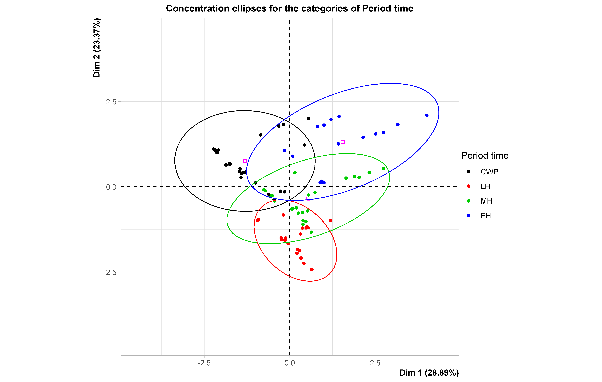

---
output:
  html_document: default
  pdf_document: default
---
# New estimations of delta R values for the South-eastern Pacific obtained from Marine20

## Contents

-   [Abstract](#abstract)
-   [Introduction](#introduction)
-   [Materials and methods](#materials-and-methods)
-   [Principal outcomes](#principal-outcomes)
-   [Discussion](##discussion)
-   [Conclusions](#conclusions)
-   [References](#references)
-   [R code](#r-code)

## Abstract

Radiocarbon ($^{14}C$) is a cosmogenic radionuclide produced in the upper atmosphere that is frequently used in paleoceanography to date sediments cores. However, dating marine sediment records have an important particularity, given that contemporaneous terrestrial and marine organism have different 14-C ages because the ocean is a source of $^{14}C$ and thus marine organisms appear to be older than contemporaneous terrestrial organisms.

This effect is called marine reservoir effect (MRE), it varies in space and time as a function of changes in upwelling intensity and the origin of the upwelled waters, and thus needs to be considered while dating marine sediment cores. Recently an internationally agreed marine radiocarbon age calibration curve (Marine20) was released and provides a global average marine record of radiocarbon from 0 to 55 calibrated Kiloyears before to present, thus serving as a baseline for regional oceanic variation.

Here we compare the marine reservoir ages (MRA) obtained from the previous version with the new calibration curve based on 86 published, marine-terrestrial pairs samples obtained in the Eastern Pacific Ocean between 0 to 50°S. We applied a bootstrapping method and the output data were sorted for spatial position and time period. Then, we calculated the MRA by error propagation and generalized additive model. According to our results, the MRA show a pattern of time-space distribution at millennial time scales, with larger MRA ages north of 22°S . These observations suggest that oceanic circulation is a key factor that modulated MRA during last 12 Kyr in the Eastern Tropical South Pacific.

Moreover, the estimated MRA using the new radiocarbon age calibration curve is up to \~400 years higher compared to the MRA obtained using the previous calibration curve, indicating that the timing of paleoceanographic events based on marine sediment records need to be revised.

## Introduction

Radiocarbon ( $^{14}C$ ) has produced by nuclear reaction due to cosmic rays in the upper atmosphere \~15km. Then C-14 is reacted with molecular oxygen to generate heavy carbon dioxide that is assimilated by primary producers via photosynthesis, reaching higher trophic levels via the food chain (Alves et al.,2018).

The contemporary distribution of C-14 in the ocean is closely related to the input of C-14 atmosphere to the ocean, the history of surface ocean $\Delta^{14}C$ ( $^{14}C/^{12}C$ ) excess depends on the mixing process and average $CO_2$ invasion rate (Broecker et al. 1985). Geographic variation in the $CO_2$ invasion rate is dealing for temperature: $CO_2$ solubility, $CO_2$ diffusion and viscosity of seawater(Broecker et al. 1985).

The important pattern is to latitudinal and longitudinal variations of $\Delta^{14}C$ are pronounced in the Pacific ocean where the sizable west-to-east decrease in water column inventory (Broecker et al. 1985).

p2: Water mass 14C in Peru and chile p3: Citation marine20 curve brief description p4: to update MRA 2011 of ( ortlieb and carre) p5: to show that hipotesis I would test with it

When researchers are trying of using radiocarbon ages for calendrical time scale interpretations or comparisons with dates obtained by other methods would be problematic (Alves et al. 2018).

It is well-known as specific biogeochemistry conditions regional effect on carbon 14 isotope. It is important to estimate this effect for dating tools that estimate to radiocarbon age during the last 50 Kyr in several areas of research. In this work, I update values of marine radiocarbon age (MRA) according to the calibrated curve (Marine20 & Shcal20). Also, I focus on the MRA relationship with space-time variables (latitude, longitude, calibrated age, and uncertainty age).

## Materials and methods

This work estimates the local radiocarbon reservoir effect off ($\Delta$R) Peru to Chile (0 to 50 °S) during the last 12 Kyr BP. Therefore, I compiled several previous estimations. It was 185 pairs (Marine and terrestrial samples of different organic materials (wood, shell and others organic remains). Bellow, I attached the input data set.


I used a Bchron package in R to estimate the maximum probability of calibrated marine and terrestrial age according to Marine20 and Shcal20, respectively. Then I calculated the difference between each pair under bootstrapping suggested by Russell et al. 2011. After that, I reduced the pool data from 185 to 90 samples for decreasing the overweight of repeated data. So that, I solve this issue, using error weight means deleting extra values and reducing error calibration.

I sorted of data (without repeated data) for period time: Early Holocene (EH) was 11.5 to 7 Kyr BP, Mid Holocene (MH) was 7 to 4 Kyr BP, Late Holocene (LH) was 4 to 0.2 Kyr BP, and Current warming period (CWP) is last 200 years; space variables: latitude and longitude; calibrated age: maximum probability age and Uncertainty of maximum probability age; $\Delta$ R: estimated value and its uncertainty.

Next, I did do a Factorial multivariate analysis, using the Factominer package, and a Generalized analysis model(GAM), using mgcv package, of 86 pairs of data. Finally, I recalculated MRA according to latitude and calibrated age before to present (Cal yr BP) in boxes, using the error weight mean for decreased error propagation.

## Principal outcomes

In this part, I would show highlight the results of this work.Multivariate analysis was based on seven selected variables over the length of whole data set (n=90). PCA results indicate that most variance of the data set ∼52% was encompassed by the first and second principal components [(fig. 1)](#principal-component-analysis-(pca)).

### Principal component analysis (PCA)

| [](https://github.com/jasb3110/Radiocarbon-reservoir/blob/db842ff0620d55ea5ca5ceec0d96a369406b6e3c/AMV.biplot.png?raw=true) |
|:----------------------------------------------------------------------:|
|                                                *Figure 1. Biplot of Principal component of data (n=90)*                                                 |

PC1 (∼29%) is interpreted as signal of latitudinal position. PC1 has the highest loading for latitude, uncertainty of $\Delta$ R and calibrated age. PC2 (∼23%) is interpreted as signal of longitudinal position. PC2 has the highest loading for calibrated age, longitude and uncertainty of $\Delta$ R [(fig. 1)](#principal-component-analysis-(pca)).

### Clusters of MRA for period time

|      [](https://github.com/jasb3110/Radiocarbon-reservoir/blob/db842ff0620d55ea5ca5ceec0d96a369406b6e3c/plotellipses.period.png?raw=true)      |
|:----------------------------------------------------------------------:|
| *Figure 2. Concentration ellipses for the categories of period time. CWP:Current warming period (black), LH:Late Holocene (red), MH:Mid Holocene (green), EH:Early Holocene (blue)* |

According to periods, It could be no evidence of a temporal effect on the MRA during the Holocene except for CWP. Therefore, I noticed a small difference between the periods.[(fig.2)](#Clusters-of-mra-for-period-time).

### Latitudinal distribution of MRA

Some past works showed the difference in latitudinal of MRA off Peru & Chile. However, it did not validate a criterion for dividing in zones before estimating MRA.


Therefore, I use GAM to find out about the spatial & temporal effect on MRA off Peru & Chile. I built a simple GAM regarding the effects of individual variables and its interactions (Wood, 2017). This model has adjusted Tweedie distribution with the logarithm link function and uses a cubic spline smooth for each variable. According to the output of GAM, this model has adjusted R-squared is 0.84; hence, this GAM represents the variability of MRA significantly.

| [](https://github.com/jasb3110/Radiocarbon-reservoir/blob/5c906b5d15b85dd72416e0abd3e72d53126c9b7b/GAM%20radiocarbon%20heat%20map.png) |
|:----------------------------------------------------------------------:|
|                                                    *Figure 3. Latitudinal distribution of MRA off Peru & Chile the last 12 Kyr BP*                                                     |

Then, I plotted a scatter of MRA, regarding calibrated age and latitude according to GAM [(fig. 3)](#latitudinal-distribution-of-mra). this picture I can see a sharp latitudinal pattern in two zones: first (O to 22°S) and second (22 to 50°S). the border between two zones could be displacement northward during the last 12 Kyr BP.

### MRA estimated under Marine20

At the state above the latitudinal pattern of MRA in two zones is reliably acceptable. Accordingly, I can estimate an MRA by latitude and periods of time, similar to previous works [(fig. 4)](#mra-estimated-under-marine20).

|                                                            [](https://github.com/jasb3110/Radiocarbon-reservoir/blob/db842ff0620d55ea5ca5ceec0d96a369406b6e3c/MRA.marine20.png?raw=true)                                                            |
|:----------------------------------------------------------------------:|
| *Figure 4. Diagram of local Marine reservoir age off Peru & Chile in boxes. Diagram of local Marine reservoir age off Peru & Chile in boxes. Orange boxes belonged from 0 to 22°S and purple boxes belonged from 22 to 50°S.The thick black lines is mean value of MRA each box.* |

In this picture, I show the estimation of local MRA in boxes. for two zones, Calibrated age of MRA does not belong same time windows. There are four boxes (two orange and two purple) boxes of MRA that have belonged to different latitudinal positions and periods of time (orange boxes: latitude 0-22°S, 10.6 to 5.8 Kyr BP and 5.6 to 0.3 Kyr BP; purple boxes: latitude 22-50°S, 12 to 6.5 Kyr BP and 3.4 to 0.1 Kyr BP).

## Discussion

|                                                                                                                 [](https://github.com/jasb3110/Radiocarbon-reservoir/blob/8bddc9b0f2d8f839ca2d4826f47d9050d49384aa/animation.gif?raw=true)                                                                                                                 |
|:----------------------------------------------------------------------:|
| *Figure 5.Animation of local MRA off Peru & Chile in boxes.Global of MRA estimated for each calibrated curve how to difference between Scal2013 & Marine2013 (grey) and Scal2020 & Marine2020(red). Estimated local of MRA by Ortlieb et al. 2011(grey); by Carré et al. 2016(green and blue) and by this work(orange and purple).The thick black lines is mean value of MRA each box* |

## Conclusions

## References

## R code

Bellow I attached a R-script. [Contact Us](mailto:solisbenites.jose@gmail.com) here, if you consider to give opinions, suggestions and questions.

``` markdown
################################################################################
#to start

setwd("~/Radiocarbon-reservoir/")#directory

library("Bchron")

#To delete outliers
d=read.csv("Radiocarbon reservoir.csv",sep=";",dec=".",header = TRUE)#data all data
d=as.data.frame(d)
d$label=paste(d$reference,d$latitude,"°","-Material:",d$type.of.material,"Sample:",d$pair,sep=" ")
d$curve=d$calibrate.curve
d$curve[d$calibrate.curve=="terrestrial"&d$Convencial.age>=126]="shcal20"#155 ± 11 BP (Hogg et al. 2019) is used in SHCal20.
d$curve[d$calibrate.curve=="marine"]="Marine20"
d$curve[which(d$calibrate.curve=="terrestrial"&d$Convencial.age<126)]="normal"
d$Convencial.age[which(d$calibrate.curve=="marine"&d$Convencial.age<603)]=604

age.t=BchronCalibrate( #It is getting calibrated in Marine20 and Shcal20
  ages = d$Convencial.age,
  ageSds = d$SD.convencial.age,
  eps = 1e-05,
  calCurves =d$curve,
  positions = d$latitude,
  ids=d$label)

hafsigma=.382924922548026#0.382924922548026 
onesigma=.682689492137086#0.682689492137086
twosigma=.954499736103642#0.954499736103642

#p=hafsigma# half sigma
#p=onesigma#one sigma
p=twosigma#two sigma

d$lower=NULL
d$upper=NULL
d$max=NULL
d$median=NULL

vvv=NULL
sss=NULL

for (i in 1:dim(d)[1]){
  d$mean[i]=sum(age.t[[i]]$densities*age.t[[i]]$ageGrid)
  d$median[i]=age.t[[i]]$ageGrid[round(length(age.t[[i]]$densities)*0.5)]
  
  if(length(age.t[[i]]$ageGrid[which(age.t[[i]]$densities==max(age.t[[i]]$densities))])==1){
  d$max[i]=age.t[[i]]$ageGrid[which(age.t[[i]]$densities==max(age.t[[i]]$densities))]
  }else{
    vvv=age.t[[i]]$ageGrid[which(age.t[[i]]$densities==max(age.t[[i]]$densities))]
    sss= abs(vvv-d$mean[i])
  d$max[i]= vvv[which(sss==min(sss))]
  }
  
  if(max(age.t[[i]]$ageGrid[which(cumsum(age.t[[i]]$densities)<cumsum(age.t[[i]]$densities)[which(age.t[[i]]$ageGrid==d$max[i])]-p*.5)])==-Inf){
  d$upper[i]=min(age.t[[i]]$ageGrid)  
  }else{
  d$upper[i]=max(age.t[[i]]$ageGrid[which(cumsum(age.t[[i]]$densities)<cumsum(age.t[[i]]$densities)[which(age.t[[i]]$ageGrid==d$max[i])]-p*.5)])
  }
  
  if(min(age.t[[i]]$ageGrid[which(cumsum(age.t[[i]]$densities)>cumsum(age.t[[i]]$densities)[which(age.t[[i]]$ageGrid==d$max[i])]+p*.5)])==Inf){
  d$lower[i]=max(age.t[[i]]$ageGrid) 
  }else{
  d$lower[i]=min(age.t[[i]]$ageGrid[which(cumsum(age.t[[i]]$densities)>cumsum(age.t[[i]]$densities)[which(age.t[[i]]$ageGrid==d$max[i])]+p*.5)])
  }
  }

d$sdmean.lower=abs(d$lower-d$mean)
d$sdmean.upper=abs(d$mean-d$upper)

d$sdmedian.lower=abs(d$lower-d$median)
d$sdmedian.upper=abs(d$median-d$upper)

d$sdmax.lower=abs(d$lower-d$max)
d$sdmax.upper=abs(d$max-d$upper)

#for (i in 1:dim(d)[1]){
#X11();plot(age.t[[i]]$ageGrid,age.t[[i]]$densities,type="l",xlab="Cal BP",ylab="Density",main =d$label[i])
#abline(v=d$mean[i],col="gray")#mean value
#abline(v=d$lower[i],col="blue")# lower value
#abline(v=d$upper[i],col="red")#upper value
#abline(v=d$median[i],col="green")#median value
#abline(v=d$max[i],col="black")#Maximum probability value, this was useful!
#

################################################################################
#According to Russel et al.2011
#density of R is estimated for bootstrapping ("n")

n=1000000# 1 millon resamples!

  funclist=list()
  for(i in 1:dim(d)[1]){
    funclist[[i]]=assign(paste0("funt",i),approxfun(density(age.t[[i]]$densities)))
    assign(paste0(d$calibrate.curve[i],i),sample(x=age.t[[i]]$ageGrid[1:length(age.t[[i]]$densities)],
                                                 size =n,
                                                 replace=TRUE,
                                                 prob = funclist[[i]](age.t[[i]]$densities[1:length(age.t[[i]]$densities)])))
  }

d$calibrate.curve[d$calibrate.curve=="normal"]="terrestrial"

################################################################################
#Estimated Radiocarbon reservoir effect each sample
#samples

rlist=list()
sec=seq(2,dim(d)[1],2)

for(i in sec){
  rlist[[i]]=assign(paste0("r",i*.5),get(paste0("marine",i-1))-get(paste0("terrestrial",i)))
}

t.r=as.data.frame(cbind(as.numeric(d$latitude[sec]),as.numeric(d$longitude[sec]),d$max[sec],d$sdmax.lower[sec]*.5+d$sdmax.upper[sec]*.5,NA,NA,d$pairs[sec],d$reference[sec],d$obs[sec],d$period.time[sec]))

colnames(t.r)=c("latitude","longitude","Cal BP(Maximun probability)","error(yr)","R","sdR","pair","reference","obs","period")

for(i in 1:length(t.r$latitude)){
t.r$R[i]=as.numeric(round(mean(get(paste0("r",i))),2))
t.r$sdR[i]=as.numeric(round(sd(get(paste0("r",i))),2))
}

label=paste0(t.r$latitude,"/",t.r$`Cal BP(Maximun probability)`,"/",t.r$longitude)
label=factor(label,levels=unique(label))
t.r$label=label

write.csv(t.r,"outcome.csv",sep=";",dec=".",col.names = TRUE) 
###############################################################################
#Method of Error propagation of variance, according to R.Reimer & P.Reimer et al. 2016
#Asumption three sample is minimum of pool database
#I create a function Error in the weighted mean().

error.weigthed.mean=function(r,dr,sigma=2,show=1,warning=0,...){
  if(is.numeric(r)&&is.numeric(dr)!=1){
    stop("Vector values is/are not number(s)") 
  }else{  
    if(sum(is.na(r)+is.na(dr))>0){
      stop("Vector values has NAs") 
    }else{ 
      if(length(r)/length(dr)!=1){ 
        stop("Vector values are not same size") 
      }else{
        if(sum(sigma<5&sigma>0)==0){
          stop("sigma is a value should be major 0 and less 5")
        }else{
          if(length(r)==1){
            rm=r
            delta.r=dr
            warn.sign="There is one value, suggesting aggregate more values"
          }else{    
          if(length(r)==2){
            rm=sum(r/dr^2)/sum( 1/dr^2)
            delta.r=sigma*sqrt(1/sum(1/dr^2))
            warn.sign="There are two values, suggesting aggregate more values"
          }else{
            rm=sum(r/dr^2)/sum( 1/dr^2)
            delta.r =sigma*sqrt((sum(((r-rm)/dr)^2)/(length(r)-1))/(sum((1/dr)^2)/length(r)))
            warn.sign=NULL
          }
        }
      }
    }
    }
  }

if(sum(warning==TRUE,warning==FALSE,warning==T,warning==F,warning==1,warning==0)==0){
    stop("if you would see warning: TRUE or T or 1 if you not: FALSE or F or 0") 
  }else{  
    if(show==TRUE){
      print(warn.sign)
    }else{
      invisible()
    }
  }

if(sum(show==TRUE,show==FALSE,show==T,show==F,show==1,show==0)==0){
  stop("if you would see results: TRUE or T or 1 if you not: FALSE or F or 0") 
  }else{  
    if(show==TRUE){
      print(paste0("Mean of Reservoir effect is ",round(rm,0)," and Uncertainty of Reservoir effect is ",round(delta.r,0)))
    }else{
      invisible()
    }
  }
outcome=c(rm,delta.r)
invisible(outcome)  
}
###############################################################################
#to reduce a repeated samples, so that it decrease overweight.
#Then repeated samples are merged according error.weigthed.mean function.
p2=unique(t.r$label)
t.r2=t.r[1:length(p2),]
t.r2[1:length(p2),]=NA
t.r2$label=p2

for(i in 1:length(p2)){
t.r2$latitude[i]=t.r$latitude[which(t.r$label==t.r2$label[i])][1]
t.r2$longitude[i]= t.r$longitude[which(t.r$label==t.r2$label[i])][1] 
t.r2$reference[i]=t.r$reference[which(t.r$label==t.r2$label[i])][1] 
t.r2$obs[i]=t.r$obs[which(t.r$label==t.r2$label[i])][1] 
t.r2$pair[i]=t.r$pair[which(t.r$label==t.r2$label[i])][1] 
t.r2$period[i]=t.r$period[which(t.r$label==t.r2$label[i])][1] 
t.r2$`Cal BP(Maximun probability)`[i]=t.r$`Cal BP(Maximun probability)`[which(t.r$label==t.r2$label[i])][1] 
t.r2$`error(yr)`[i]=t.r$`error(yr)`[which(t.r$label==t.r2$label[i])][1] 
t.r2$R[i]=error.weigthed.mean(as.numeric(t.r$R[which(t.r$label==t.r2$label[i])]),dr=as.numeric(t.r$sdR[which(t.r$label==t.r2$label[i])]),sigma = 1,show = 0,warning = 0)[1]
t.r2$sdR[i]=error.weigthed.mean(as.numeric(t.r$R[which(t.r$label==t.r2$label[i])]),dr=as.numeric(t.r$sdR[which(t.r$label==t.r2$label[i])]),sigma = 1,show = 0,warning = 0)[2]
}

t.r2$label=NULL

write.csv(t.r2,"outcome2.csv",sep=";",dec=".",col.names = TRUE)  

###############################################################################
# To estimate of Radiocarbon reservoir effect on Boxes.

#for latitude 0°S-22°S during 6000 to 10500 yr BP
w=-22
sigma1=2
showme=1
warn=1

Rp1=as.numeric(t.r2$R[as.numeric(t.r2$latitude)>w&as.numeric(t.r2$`Cal BP(Maximun probability)`)>6000&t.r2$obs!="not relationship"])
sRp1=as.numeric(t.r2$sdR[as.numeric(t.r2$latitude)>w&as.numeric(t.r2$`Cal BP(Maximun probability)`)>6000&t.r2$obs!="not relationship"])
c1=as.numeric(t.r2$`Cal BP(Maximun probability)`[as.numeric(t.r2$latitude)>w&as.numeric(t.r2$`Cal BP(Maximun probability)`)>6000&t.r2$obs!="not relationship"])
p1=error.weigthed.mean(Rp1,sRp1,sigma1,showme,warn)

#during 100 to 5500 yr BP
Rp2=as.numeric(t.r2$R[as.numeric(t.r2$latitude)>w&as.numeric(t.r2$`Cal BP(Maximun probability)`)>100&as.numeric(t.r2$`Cal BP(Maximun probability)`)<5500&t.r2$obs!="not relationship"])
sRp2=as.numeric(t.r2$sdR[as.numeric(t.r2$latitude)>w&as.numeric(t.r2$`Cal BP(Maximun probability)`)>100&as.numeric(t.r2$`Cal BP(Maximun probability)`)<5500&t.r2$obs!="not relationship"])
c2=as.numeric(t.r2$`Cal BP(Maximun probability)`[as.numeric(t.r2$latitude)>w&as.numeric(t.r2$`Cal BP(Maximun probability)`)>100&as.numeric(t.r2$`Cal BP(Maximun probability)`)<5500&t.r2$obs!="not relationship"])
p2=error.weigthed.mean(Rp2,sRp2,sigma1,showme,warn)

#during 100 to 4000 yr BP
#Rp3=as.numeric(t.r2$R[as.numeric(t.r2$latitude)>w&as.numeric(t.r2$`Cal BP(Maximun probability)`)>100&as.numeric(t.r2$`Cal BP(Maximun probability)`)<4000&t.r2$obs!="not relationship"])
#sRp3=as.numeric(t.r2$sdR[as.numeric(t.r2$latitude)>w&as.numeric(t.r2$`Cal BP(Maximun probability)`)>100&as.numeric(t.r2$`Cal BP(Maximun probability)`)<4000&t.r2$obs!="not relationship"])
#error.weigthed.mean(Rp3,sRp3,sigma1,showme,warn)

#during -10 to 100 yr BP
Rp4=as.numeric(t.r2$R[as.numeric(t.r2$latitude)>w&as.numeric(t.r2$`Cal BP(Maximun probability)`)>-10&as.numeric(t.r2$`Cal BP(Maximun probability)`)<100&t.r2$obs!="not relationship"])
sRp4=as.numeric(t.r2$sdR[as.numeric(t.r2$latitude)>w&as.numeric(t.r2$`Cal BP(Maximun probability)`)>-10&as.numeric(t.r2$`Cal BP(Maximun probability)`)<100&t.r2$obs!="not relationship"])
c3=as.numeric(t.r2$`Cal BP(Maximun probability)`[as.numeric(t.r2$latitude)>w&as.numeric(t.r2$`Cal BP(Maximun probability)`)>-10&as.numeric(t.r2$`Cal BP(Maximun probability)`)<100&t.r2$obs!="not relationship"])
p3=error.weigthed.mean(Rp4,sRp4,sigma1,showme,warn)

#for latitude-22°S-51°S
#during 6000 to 10500 yr BP
Rp5=as.numeric(t.r2$R[as.numeric(t.r2$latitude)<w&as.numeric(t.r2$`Cal BP(Maximun probability)`)>6000])
sRp5=as.numeric(t.r2$sdR[as.numeric(t.r2$latitude)<w&as.numeric(t.r2$`Cal BP(Maximun probability)`)>6000])
c4=as.numeric(t.r2$`Cal BP(Maximun probability)`[as.numeric(t.r2$latitude)<w&as.numeric(t.r2$`Cal BP(Maximun probability)`)>6000])
p4=error.weigthed.mean(Rp5,sRp5,sigma1,showme,warn)

#during 100 to 5500 yr BP
Rp6=as.numeric(t.r2$R[as.numeric(t.r2$latitude)<w&as.numeric(t.r2$`Cal BP(Maximun probability)`)>100&as.numeric(t.r2$`Cal BP(Maximun probability)`)<5500&t.r2$obs!="not relationship"])
sRp6=as.numeric(t.r2$sdR[as.numeric(t.r2$latitude)<w&as.numeric(t.r2$`Cal BP(Maximun probability)`)>100&as.numeric(t.r2$`Cal BP(Maximun probability)`)<5500&t.r2$obs!="not relationship"])
c5=as.numeric(t.r2$`Cal BP(Maximun probability)`[as.numeric(t.r2$latitude)<w&as.numeric(t.r2$`Cal BP(Maximun probability)`)>100&as.numeric(t.r2$`Cal BP(Maximun probability)`)<5500&t.r2$obs!="not relationship"])
p5=error.weigthed.mean(Rp6,sRp6,sigma1,showme,warn)

#during -10 to 100 yr BP
Rp8=as.numeric(t.r2$R[as.numeric(t.r2$latitude)<w&as.numeric(t.r2$`Cal BP(Maximun probability)`)>-10&as.numeric(t.r2$`Cal BP(Maximun probability)`)<100&t.r2$obs!="not relationship"])
sRp8=as.numeric(t.r2$sdR[as.numeric(t.r2$latitude)<w&as.numeric(t.r2$`Cal BP(Maximun probability)`)>-10&as.numeric(t.r2$`Cal BP(Maximun probability)`)<100&t.r2$obs!="not relationship"])
c6=as.numeric(t.r2$`Cal BP(Maximun probability)`[as.numeric(t.r2$latitude)<w&as.numeric(t.r2$`Cal BP(Maximun probability)`)>-10&as.numeric(t.r2$`Cal BP(Maximun probability)`)<100&t.r2$obs!="not relationship"])
p6=error.weigthed.mean(Rp8,sRp8,sigma1,showme,warn)

###############################################################################
#Multivariate analysis 
#Factominer
library("FactoMineR")
library("vegan")
library("mgcv")
library("mgcViz")
library("gganimate")
library("gamm4")

t.r2=t.r2[t.r2$obs!="not relationship",]

t.r2$period[t.r2$`Cal BP(Maximun probability)`>7000]="EH"
t.r2$period[t.r2$`Cal BP(Maximun probability)`>4000&t.r2$`Cal BP(Maximun probability)`<7000]="MH"
t.r2$period[t.r2$`Cal BP(Maximun probability)`>200&t.r2$`Cal BP(Maximun probability)`<4000]="LH"
t.r2$period[t.r2$`Cal BP(Maximun probability)`<200]="CWP"

sp=t.r2[,c(1,2)]
dat=t.r2[,c(3,4)]
reser=t.r2[,c(5,6)]
#ref=factor(t.r2$obs,levels=unique(t.r2$obs))
ref=factor(t.r2$period,levels=c("CWP","LH","MH","EH"))

tab<- data.frame(ref,sp,dat,reser)

tab$latitude=as.numeric(t.r2$latitude)
tab$longitude=as.numeric(t.r2$longitude)
tab$Cal.BP.Maximun.probability.=as.numeric(tab$Cal.BP.Maximun.probability.)
tab$error.yr.=as.numeric(tab$error.yr.)
tab$R=as.numeric(tab$R)
tab$sdR=as.numeric(tab$sdR)

colnames(tab)=c("Period time","latitude°S",
                "longitude°W","Maximun probability (Cal BP)",
                "Uncertainty Maximun probability (Cal BP)",
                expression("\u0394R"),
                paste0("Uncertainty ",expression("\u0394R")))
              
gr<- c(1,ncol(sp),ncol(dat),ncol(reser))

t.mfa <- MFA(tab,
             group = gr,
             type = c("n","c","c","c"),
             ncp =,
             name.group = c("Period time","Space","Calibrated age (yrs BP)","\u0394R"),
             graph =FALSE)

# Plot the results
MFA1=plot(t.mfa,
          choix = "axes",
          habillage = "group",
          shadowtext = TRUE)

ggsave("AMV.dimesiones.png", dpi = 900,   width = 250,
       height = 159,unit="mm",plot =MFA1)

#x11();plot(
#t.mfa,
#choix = "ind",
#partial = "all",
#habillage = "group")

MFA2=plot(t.mfa,
          choix = "var",
          habillage = "group",
          graph.type = "ggplot",
          shadowtext =TRUE)
#x11();MFA2

ggsave("AMV.biplot.png", dpi = 900,   width = 250,
       height = 159,unit="mm",plot =MFA2)

MFA3=plot(t.mfa, choix = "group")
ggsave("AMV.grupos.png", dpi = 600,   width = 250,
       height = 159,unit="mm",plot =MFA3)

# Eigenvalues, screen plot and broken stick model
source ('https://raw.githubusercontent.com/zdealveindy/anadat-r/master/scripts/NumEcolR2/screestick.R')
ev<- t.mfa$eig[, 1]
names(ev) <- paste("MFA", 1 : length(ev))

png("Eigenvalues.stick.png", width = 250, height = 159, units = 'mm', res =600)
screestick(ev, las = 3)
dev.off()

#cross-relation
pvalue <- t.mfa$group$RV
pvalue
contr=t.mfa$group$contrib
contr
corrr=t.mfa$group$correlation
corrr

## Not run: 
#### Confidence ellipses around categories per variable

png("plotellipses.period.png", width =250, height = 159, units = 'mm', res =600)
plotellipses(t.mfa,keepvar=1,label="none",level=0.95, means=FALSE,graph.type ="ggplot" ,xlim = c(-4.5,4.5),ylim = c(-4.5,4.5))
dev.off()

################################################################################
#Generalized additive model
#I use data without replicated value. it are 86 samples.

r.d=t.r2
colnames(r.d)=c("la","lo","cal","e","r","sdr","ref")

r.d$r=as.numeric(t.r2$R)+1-min(as.numeric(t.r2$R))
r.d$sdr=as.numeric(t.r2$sdR)
r.d$la=-1*as.numeric(t.r2$latitude)
r.d$lo=-1*as.numeric(t.r2$longitude)
r.d$e=as.numeric(t.r2$`error(yr)`)
r.d$cal=as.numeric(t.r2$`Cal BP(Maximun probability)`)+1-min(as.numeric(t.r2$`Cal BP(Maximun probability)`))
r.d=as.data.frame(r.d)
###############################################################################
#GAM for radiocarbon reservoir effect on Peru 

r.effect.gam<-gam(r~s(la,lo)+s(cal)+s(e)+s(cal,e),family =tw,data =r.d)
#r.effect.gam2<-gam(r~te(la,lo)+t2(cal,label, bs ="re")+t2(e,label, bs ="re")+ti(cal,e,label,bs ="re"),family =tw,data =rd)# not possible to use replicated values

png("r.gam.check.plot.png", width = 250, height = 159, units = 'mm', res =600)
par(mfrow = c(2,2))
gam.check(r.effect.gam)
dev.off()

anova(r.effect.gam)
summary(r.effect.gam)

r.viz.gam=getViz(r.effect.gam)
r.trt.gam <- plot(r.viz.gam, allTerms = T) +theme_test()

png("r.gam.plot.png", width = 250, height = 159, units = 'mm', res =1200)
print(r.trt.gam, pages = 1)
dev.off()

error.effect.gam<-gam(sdr~s(la,lo)+s(cal)+s(e)+s(cal,e),family =tw,data =r.d)
summary(error.effect.gam)
anova(error.effect.gam)

png("error.gam.check.plot.png", width = 250, height = 159, units = 'mm', res =600)
par(mfrow = c(2,2))
gam.check(error.effect.gam)
dev.off()

error.viz.gam=getViz(error.effect.gam)
error.trt.gam <- plot(error.viz.gam, allTerms = T) +theme_test()

png("error.gam.plot.png", width = 500, height = 318, units = 'mm', res =1200)
print(error.trt.gam, pages = 1)
dev.off()

###############################################################################
library("itsadug")
#Heat map of Radiocarbon reservoir off Peru & Chile during last 12 Kyrs

png("R.reservoir.png", width = 500, height = 318, units = 'mm', res =900)
fvisgam(r.effect.gam,n.grid =100,color="topo", view=c("cal","la"),ylim=c(0,50),xlim =c(0,12000),nCol=100,show.diff =FALSE,hide.label = TRUE,rm.ranef=TRUE,transform = "exp", print.summary=FALSE, labcex=0.1,alpha.diff = 0.05,xlab="Calibrated age (Kyrs BP)",ylab="latitude °S")
dev.off()

###############################################################################
toplot=read.csv("comparacion de las curvas de calibracion.csv",sep=";",dec=".",header = TRUE)# Data for plotting (Marine 20, 13; Shcal 20, 13; $/Delta$R estimated for Ortlieb and Carré)
library(ggplot2)
library(ggh4x)
library(reprex)
library(tidyverse)

#reliable level
#90% CL=1.645
#95% CL=1.96
#99% CL=2.575

cl=1.96#2 sigma

m0=.95#5% minor than the smallest value of calibrated data
mf=1.05#5% major than the biggest value of calibrated data

toplot$R.Solis.et.al..2022[1]=round(p1[1],0)
toplot$X1.sigma.sdR.Solis.et.al..2022[1]=round(p1[2]*.5,0)
toplot$X2.sigmas.sdR.Solis.et.al..2022[1]=round(p1[2],0)
toplot$max.age.solis[1]=round(min(c1)*m0,0)
toplot$min.age.solis[1]=round(max(c1)*mf,0)

toplot$R.Solis.et.al..2022[2]=round(p2[1],0)
toplot$X1.sigma.sdR.Solis.et.al..2022[2]=round(p2[2]*.5,0)
toplot$X2.sigmas.sdR.Solis.et.al..2022[2]=round(p2[2],0)
toplot$max.age.solis[2]=round(min(c2)*m0,0)
toplot$min.age.solis[2]=round(max(c2)*mf,0)

toplot$R.Solis.et.al..2022[3]=round(p3[1],0)
toplot$X1.sigma.sdR.Solis.et.al..2022[3]=round(p3[2]*.5,0)
toplot$X2.sigmas.sdR.Solis.et.al..2022[3]=round(p3[2],0)
toplot$max.age.solis[3]=round(min(c3)*m0,0)
toplot$min.age.solis[3]=round(max(c3)*mf,0)

toplot$R.Solis.et.al..2022[4]=round(p4[1],0)
toplot$X1.sigma.sdR.Solis.et.al..2022[4]=round(p4[2]*.5,0)
toplot$X2.sigmas.sdR.Solis.et.al..2022[4]=round(p4[2],0)
toplot$max.age.solis[4]=round(min(c4)*m0,0)
toplot$min.age.solis[4]=round(max(c4)*mf,0)

toplot$R.Solis.et.al..2022[5]=round(p5[1],0)
toplot$X1.sigma.sdR.Solis.et.al..2022[5]=round(p5[2]*.5,0)
toplot$X2.sigmas.sdR.Solis.et.al..2022[5]=round(p5[2],0)
toplot$max.age.solis[5]=round(min(c5)*m0,0)
toplot$min.age.solis[5]=round(max(c5)*mf,0)

toplot$R.Solis.et.al..2022[6]=round(p6[1],0)
toplot$X1.sigma.sdR.Solis.et.al..2022[6]=round(p6[2]*.5,0)
toplot$X2.sigmas.sdR.Solis.et.al..2022[6]=round(p6[2],0)
toplot$max.age.solis[6]=round(min(c6)*m0,0)
toplot$min.age.solis[6]=round(max(c6)*mf,0)

#SHCAL13
toplot$min.shcal13=toplot$shcal13-toplot$shcal13.sd*cl
toplot$max.shcal13=toplot$shcal13+toplot$shcal13.sd*cl

#SHCAL20
toplot$min.shcal20=toplot$shcal20-toplot$shcal20.sd*cl
toplot$max.shcal20=toplot$shcal20+toplot$shcal20.sd*cl

#marine04
toplot$min.marine04=toplot$marine04-toplot$marine04.sd*cl
toplot$max.marine04=toplot$marine04+toplot$marine04.sd*cl

#marine13
toplot$min.marine13=toplot$marine13-toplot$marine13.sd*cl
toplot$max.marine13=toplot$marine13+toplot$marine13.sd*cl

#marine20
toplot$min.marine20=toplot$marine20-toplot$marine20.sd*cl
toplot$max.marine20=toplot$marine20+toplot$marine20.sd*cl

#Difference of Marine-terrestrial under bootstrap (n=1000000)

error.subs.prop=function(nn=1000000,m1,sd1,m2,sd2){
out=rnorm(nn,m1,sd1)-rnorm(nn,m2,sd2)
outcome=c(mean(out),sd(out))
invisible(outcome)  
}

for(i in 1:length(na.omit(toplot$marine13))){
outy=error.subs.prop(nn = 100000,
                    toplot$marine13[i],
                    toplot$marine13.sd[i],
                    toplot$shcal13[which(toplot$age.shcal13==toplot$age.marine13[i])],
                    toplot$shcal13.sd[which(toplot$age.shcal13==toplot$age.marine13[i])])  
toplot$MRA.marine13.mean[i]=round(outy[1],digits = 0)
toplot$MRA.marine13.sd[i]  =round(outy[2],digits = 0)
}

for(i in 1:length(na.omit(toplot$marine20))){
  outy=error.subs.prop(nn = 100000,
                       toplot$marine20[i],
                       toplot$marine20.sd[i],
                       toplot$shcal20[which(toplot$age.shcal20==toplot$age.marine20[i])],
                       toplot$shcal20.sd[which(toplot$age.shcal20==toplot$age.marine20[i])])  
  toplot$MRA.marine20.mean[i]=round(outy[1],digits = 0)
  toplot$MRA.marine20.sd[i]  =round(outy[2],digits = 0)
}

toplot$MRA.marine20.max=toplot$MRA.marine20.mean+toplot$MRA.marine20.sd*cl
toplot$MRA.marine20.min=toplot$MRA.marine20.mean-toplot$MRA.marine20.sd*cl
toplot$MRA.marine13.max=toplot$MRA.marine13.mean+toplot$MRA.marine13.sd*cl
toplot$MRA.marine13.min=toplot$MRA.marine13.mean-toplot$MRA.marine13.sd*cl

labely=expression(paste("Radiocarbon age ("^{14},"C yr BP)"))

labely2=expression(paste("MRA ("^{14},"C yr)"))

  al=.02# transparency factor
  aq=.01
  aw=.005
  a1="gray" #colour 
  a2="blue"
  a3="green"
  a4="red"
  a5="orange"
  a6="purple"
######################
#Zones of another works
  toplot$Zone.carre[1:2]=as.character("Zone 1: 0-24°S")
  toplot$Zone.carre[3:4]=as.character("Zone 2: 24-32°S")
  toplot$Zone.ortlieb[1:4]=as.character("Zone : 14-24°S")
  
#MRA according to Marine20
toplot$Zone.solis[1:3]=as.character("Zone 1: 0-22°S")
toplot$Zone.solis[4:6]=as.character("Zone 2: 22-50°S")
t.r2$zone=NA

t.r2$latitude=as.numeric(t.r2$latitude)
t.r2$zone=rep(NA,length(t.r2$latitude))
t.r2$zone[which(t.r2$latitude>22*-1)]=as.character("Zone 1: 0-22°S")
t.r2$zone[which(t.r2$latitude<22*-1)]=as.character("Zone 2: 22-50°S")
t.r2$zone=factor(t.r2$zone,levels=c("Zone 1: 0-22°S","Zone 2: 22-50°S"))

t.r2$`Cal BP(Maximun probability)`=as.numeric(t.r2$`Cal BP(Maximun probability)`)
t.r2$R=as.numeric(t.r2$R)
t.r2$`error(yr)`=as.numeric(t.r2$`error(yr)`)
t.r2$R=as.numeric(t.r2$R)
t.r2$sdR=as.numeric(t.r2$sdR)

#For updated $/Delta$ R Marine20 and Shcal20

MRA.marine20=ggplot(data =t.r2,aes(x=`Cal BP(Maximun probability)`,y=R),size=1)+

  geom_rect(aes(xmin = toplot$min.age.solis[1], 
                xmax = toplot$max.age.solis[1], 
                ymin = toplot$R.Solis.et.al..2022[1]-toplot$X1.sigma.sdR.Solis.et.al..2022[1],
                ymax = toplot$R.Solis.et.al..2022[1]+toplot$X1.sigma.sdR.Solis.et.al..2022[1]),
            alpha = aq,
            fill = a5)+
  
  geom_rect(aes(xmin = toplot$min.age.solis[2], 
                xmax = toplot$max.age.solis[2], 
                ymin = toplot$R.Solis.et.al..2022[2]-toplot$X1.sigma.sdR.Solis.et.al..2022[2],
                ymax = toplot$R.Solis.et.al..2022[2]+toplot$X1.sigma.sdR.Solis.et.al..2022[2]),
            alpha = aq,
            fill = a5)+
 
  geom_rect(aes(xmin = toplot$min.age.solis[4], 
              xmax = toplot$max.age.solis[4], 
              ymin = toplot$R.Solis.et.al..2022[4]-toplot$X1.sigma.sdR.Solis.et.al..2022[4],
              ymax = toplot$R.Solis.et.al..2022[4]+toplot$X1.sigma.sdR.Solis.et.al..2022[4]),
          alpha = aq,
          fill = a6)+

  geom_rect(aes(xmin = toplot$min.age.solis[5], 
                xmax = toplot$max.age.solis[5], 
                ymin = toplot$R.Solis.et.al..2022[5]-toplot$X2.sigmas.sdR.Solis.et.al..2022[5],
                ymax = toplot$R.Solis.et.al..2022[5]+toplot$X2.sigmas.sdR.Solis.et.al..2022[5]),
            alpha = aq,
            fill = a6)+
  geom_errorbar(aes(ymin=t.r2$R-t.r2$sdR,ymax=t.r2$R+t.r2$sdR),width=5,
                            position = position_dodge(0.5),lwd=.1)+
  geom_errorbarh(aes(xmin=t.r2$`Cal BP(Maximun probability)`-t.r2$`error(yr)`,xmax=t.r2$`Cal BP(Maximun probability)`+t.r2$`error(yr)`),height=5,
              position = position_dodge(0.5),lwd=.1)+
              geom_point(aes(color=zone),size=2,show.legend =FALSE)+
  
  geom_segment(aes(y =(toplot$R.Solis.et.al..2022[1]),
                   yend =(toplot$R.Solis.et.al..2022[1]),
                   x=(toplot$min.age.solis[1]),
                   xend=toplot$max.age.solis[1]),colour="black", size = .75)+
  
  geom_segment(aes(y =(toplot$R.Solis.et.al..2022[2]),
                   yend =(toplot$R.Solis.et.al..2022[2]),
                   x=(toplot$min.age.solis[2]),
                   xend=toplot$max.age.solis[2]),colour="black",size = .75)+
  
  geom_segment(aes(y =toplot$R.Solis.et.al..2022[4],
                   yend =toplot$R.Solis.et.al..2022[4],
                   x=toplot$min.age.solis[4],
                   xend=toplot$max.age.solis[4]),colour="black", size = .75)+
  
  geom_segment(aes(y =toplot$R.Solis.et.al..2022[5],
                   yend =toplot$R.Solis.et.al..2022[5],
                   x=toplot$min.age.solis[5],
                   xend=toplot$max.age.solis[5]),colour="black", size = .75)+
  geom_point(size =1.6, fill ="black", colour = "black",show.legend =FALSE)+
  geom_point(aes(fill= zone,colour=zone),size =1.5,show.legend =FALSE)+
 
  annotate("text",x=2000,y=1500,label="\u0394R Box  0-22°S", size = 8,col=a5)+
  annotate("text",x=2000,y=1300,label="\u0394R Box 22-50°S", size = 8,col=a6)+
  
  annotate("text",x=toplot$min.age.solis[1]*.5+toplot$max.age.solis[1]*.5,y=round(toplot$R.Solis.et.al..2022[1]*1.6),label=paste0("\u0394R=",toplot$R.Solis.et.al..2022[1],"\u00b1",toplot$X1.sigma.sdR.Solis.et.al..2022[1]), size = 6)+
  annotate("text",x=toplot$min.age.solis[2]*.5+toplot$max.age.solis[2]*.5,y=round(toplot$R.Solis.et.al..2022[2]*2.1),label=paste0("\u0394R=",toplot$R.Solis.et.al..2022[2],"\u00b1",toplot$X1.sigma.sdR.Solis.et.al..2022[2]), size = 6)+
  
  annotate("text",x=toplot$min.age.solis[4]*.5+toplot$max.age.solis[4]*.5,y=round(toplot$R.Solis.et.al..2022[4]*5.5),label=paste0("\u0394R=",toplot$R.Solis.et.al..2022[4],"\u00b1",toplot$X1.sigma.sdR.Solis.et.al..2022[4]), size = 6)+
  annotate("text",x=toplot$min.age.solis[5]*.5+toplot$max.age.solis[5]*.5,y=round(toplot$R.Solis.et.al..2022[5]*-1.2),label=paste0("\u0394R=",toplot$R.Solis.et.al..2022[5],"\u00b1",toplot$X1.sigma.sdR.Solis.et.al..2022[5]), size = 6)+
  
  scale_x_continuous(breaks =scales::pretty_breaks(n = 5),
                   minor_breaks = seq(0,12000,by=1000),
                   limits = c(0,12050))+
  scale_y_continuous(limits = c(-500,1500),labels = scales::comma,breaks =scales::pretty_breaks(n = 8))+
  labs(colour="",title="Marine reservoir age off Peru & Chile for this study",
       x ="Cal yr BP", 
       y =labely2)+
  theme_classic()+
  theme(legend.position="top",legend.title=element_blank(),legend.text = element_text(color = "black", size = 14,face="bold"),
        axis.text.x=element_text(size=11,colour = "black",face="bold",hjust=0.5,vjust = 0.5),axis.text.y=element_text(size=11,colour = "black",face="bold",hjust=0.5,vjust = 0.5),
        axis.title=element_text(size=14,face="bold"),title = element_text(size=16,colour = "black",face="bold"))

#x11();MRA.marine20
ggsave("MRA.marine20.png", dpi = 1200,   width = 275,
       height = 175,unit="mm",plot =MRA.marine20)

###############################################################################
#For updated $/Delta$ R Marine04 and Shcal04 (Ortlieb et al. 2011)
reservoir=ggplot(data =toplot)+
  geom_line(aes(x=toplot$age.marine13,y=toplot$MRA.marine13.mean),alpha=0.5,show.legend = FALSE)+geom_ribbon(aes(x=toplot$age.marine13,ymax=toplot$MRA.marine13.max,ymin=toplot$MRA.marine13.min),alpha=0.5,show.legend = FALSE)+
  geom_line(aes(x=toplot$age.marine20,y=toplot$MRA.marine20.mean,colour=colors()[29]),alpha=0.6,show.legend = FALSE)+geom_ribbon(aes(x=toplot$age.marine20,ymax=toplot$MRA.marine20.max,ymin=toplot$MRA.marine20.min,fill=colors()[29]),alpha=0.6,show.legend = FALSE)+
  
  #ortlieb et al., 2011
  geom_rect(aes(xmin = toplot$min.age.ortlieb[1], 
                xmax = toplot$max.age.ortlieb[1], 
                ymin = toplot$R.Ortlieb.et.al..2011[1]-toplot$X1.sigma.sdR.Ortlieb.et.al..2011[1],
                ymax = toplot$R.Ortlieb.et.al..2011[1]+toplot$X1.sigma.sdR.Ortlieb.et.al..2011[1]),
                alpha = al,
                fill = a1)+
  geom_segment(aes(y =toplot$R.Ortlieb.et.al..2011[1],
                   yend =toplot$R.Ortlieb.et.al..2011[1],
                   x=toplot$min.age.ortlieb[1],
                   xend=toplot$max.age.ortlieb[1]))+
  
  geom_rect(aes(xmin = toplot$min.age.ortlieb[2], 
                xmax = toplot$max.age.ortlieb[2], 
                ymin = toplot$R.Ortlieb.et.al..2011[2]-toplot$X1.sigma.sdR.Ortlieb.et.al..2011[2],
                ymax = toplot$R.Ortlieb.et.al..2011[2]+toplot$X1.sigma.sdR.Ortlieb.et.al..2011[2]),
            alpha = al,
            fill = a1)+
  geom_segment(aes(y =toplot$R.Ortlieb.et.al..2011[2],
                   yend =toplot$R.Ortlieb.et.al..2011[2],
                   x=toplot$min.age.ortlieb[2],
                   xend=toplot$max.age.ortlieb[2]))+
  
  geom_rect(aes(xmin = toplot$min.age.ortlieb[3], 
                xmax = toplot$max.age.ortlieb[3], 
                ymin = toplot$R.Ortlieb.et.al..2011[3]-toplot$X1.sigma.sdR.Ortlieb.et.al..2011[3],
                ymax = toplot$R.Ortlieb.et.al..2011[3]+toplot$X1.sigma.sdR.Ortlieb.et.al..2011[3]),
            alpha = al,
            fill = a1)+
  geom_segment(aes(y =toplot$R.Ortlieb.et.al..2011[3],
                   yend =toplot$R.Ortlieb.et.al..2011[3],
                   x=toplot$min.age.ortlieb[3],
                   xend=toplot$max.age.ortlieb[3]))+
  
  geom_rect(aes(xmin = toplot$min.age.ortlieb[4], 
                xmax = toplot$max.age.ortlieb[4], 
                ymin = toplot$R.Ortlieb.et.al..2011[4]-toplot$X1.sigma.sdR.Ortlieb.et.al..2011[4],
                ymax = toplot$R.Ortlieb.et.al..2011[4]+toplot$X1.sigma.sdR.Ortlieb.et.al..2011[4]),
            alpha =al,
            fill = a1)+
  geom_segment(aes(y =toplot$R.Ortlieb.et.al..2011[4],
                   yend=toplot$R.Ortlieb.et.al..2011[4],
                   x=toplot$min.age.ortlieb[4],
                   xend=toplot$max.age.ortlieb[4]))+
  
  annotate("text",x=2500,y=1500,label="\u0394MRA (Marine20 - Shcal20)", size = 8,col="red")+
  annotate("text",x=2500,y=1300,label="\u0394MRA (Marine13 - Shcal13)", size = 8,col="gray")+
  annotate("text",x=2500,y=1100,label="\u0394R(t) on 14-24°S", size = 8,col="gray80")+

  scale_x_continuous(breaks =scales::pretty_breaks(n = 5),
                   minor_breaks = seq(0,12000,by=1000),
                   limits = c(0,12050))+
  scale_y_continuous(limits = c(-500,1500),labels = scales::comma,breaks =scales::pretty_breaks(n = 6))+
  labs(colour="",title="Marine reservoir age off Peru & Chile according to Ortlieb et al. 2011",
     x ="Cal yr BP", 
     y =labely2)+
  theme_classic()+
  theme(legend.position="top",legend.title=element_blank(),legend.text = element_text(color = "black", size = 14,face="bold"),
        axis.text.x=element_text(size=11,colour = "black",face="bold",hjust=0.5,vjust = 0.5),axis.text.y=element_text(size=11,colour = "black",face="bold",hjust=0.5,vjust = 0.5),
        axis.title=element_text(size=14,face="bold"),title = element_text(size=16,colour = "black",face="bold"))

#x11();reservoir
ggsave("reservoir.png", dpi = 900,   width = 275,
       height = 175,unit="mm",plot =reservoir)

###############################################################################
#For updated $/Delta$ R Marine13 and Shcal13 (Carré et al. 2016)

reservoir2=ggplot(data =toplot)+
  geom_line(aes(x=toplot$age.marine13,y=toplot$MRA.marine13.mean),alpha=0.5,show.legend = FALSE)+geom_ribbon(aes(x=toplot$age.marine13,ymax=toplot$MRA.marine13.max,ymin=toplot$MRA.marine13.min),alpha=0.5,show.legend = FALSE)+
  geom_line(aes(x=toplot$age.marine20,y=toplot$MRA.marine20.mean,colour=colors()[29]),alpha=0.6,show.legend = FALSE)+geom_ribbon(aes(x=toplot$age.marine20,ymax=toplot$MRA.marine20.max,ymin=toplot$MRA.marine20.min,fill=colors()[29]),alpha=0.6,show.legend = FALSE)+
#Carre et al., 2016
geom_rect(aes(xmin = toplot$min.age.carre[1], 
              xmax = toplot$max.age.carre[1], 
              ymin = toplot$R.Carre.et.al..2016[1]-toplot$X1.sigma.sdR.Carre.et.al..2016[1],
              ymax = toplot$R.Carre.et.al..2016[1]+toplot$X1.sigma.sdR.Carre.et.al..2016[1]),
          alpha = aw,
          fill = a2)+
  geom_segment(aes(y =toplot$R.Carre.et.al..2016[1],
                   yend =toplot$R.Carre.et.al..2016[1],
                   x=toplot$min.age.carre[1],
                   xend=toplot$max.age.carre[1]))+
  
  geom_rect(aes(xmin = toplot$min.age.carre[2], 
                xmax = toplot$max.age.carre[2], 
                ymin = toplot$R.Carre.et.al..2016[2]-toplot$X1.sigma.sdR.Carre.et.al..2016[2],
                ymax = toplot$R.Carre.et.al..2016[2]+toplot$X1.sigma.sdR.Carre.et.al..2016[2]),
            alpha = aw,
            fill = a2)+
  geom_segment(aes(y =toplot$R.Carre.et.al..2016[2],
                   yend =toplot$R.Carre.et.al..2016[2],
                   x=toplot$min.age.carre[2],
                   xend=toplot$max.age.carre[2]))+
  
  geom_rect(aes(xmin = toplot$min.age.carre[3], 
                xmax = toplot$max.age.carre[3], 
                ymin = toplot$R.Carre.et.al..2016[3]-toplot$X1.sigma.sdR.Carre.et.al..2016[3],
                ymax = toplot$R.Carre.et.al..2016[3]+toplot$X1.sigma.sdR.Carre.et.al..2016[3]),
            alpha = aw,
            fill = a3)+
  geom_segment(aes(y =toplot$R.Carre.et.al..2016[3],
                   yend =toplot$R.Carre.et.al..2016[3],
                   x=toplot$min.age.carre[3],
                   xend=toplot$max.age.carre[3]))+
  
  geom_rect(aes(xmin = toplot$min.age.carre[4], 
                xmax = toplot$max.age.carre[4], 
                ymin = toplot$R.Carre.et.al..2016[4]-toplot$X1.sigma.sdR.Carre.et.al..2016[4],
                ymax = toplot$R.Carre.et.al..2016[4]+toplot$X1.sigma.sdR.Carre.et.al..2016[4]),
            alpha = aw,
            fill = a3)+
  geom_segment(aes(y =toplot$R.Carre.et.al..2016[4],
                   yend =toplot$R.Carre.et.al..2016[4],
                   x=toplot$min.age.carre[4],
                   xend=toplot$max.age.carre[4]))+

  annotate("text",x=2500,y=1500,label="\u0394MRA (Marine20 - Shcal20)", size = 8,col="red")+
  annotate("text",x=2500,y=1300,label="\u0394MRA (Marine13 - Shcal13)", size = 8,col="gray80")+
  annotate("text",x=2500,y=1100,label="\u0394R(t) on  0-24°S", size = 8,col=a2)+
  annotate("text",x=2500,y=900 ,label="\u0394R(t) on 24-32°S", size = 8,col=a3)+
  
  scale_x_continuous(breaks =scales::pretty_breaks(n = 5),
                     minor_breaks = seq(0,12000,by=1000),
                     limits = c(0,12050))+
  scale_y_continuous(limits = c(-500,1500),labels = scales::comma,breaks =scales::pretty_breaks(n = 6))+
  labs(colour="",title="Marine reservoir age off Peru & Chile according to Carré et al. 2016",
       x ="Cal yr BP", 
       y =labely2)+
  theme_classic()+
  theme(legend.position="top",legend.title=element_blank(),legend.text = element_text(color = "black", size = 14,face="bold"),
        axis.text.x=element_text(size=11,colour = "black",face="bold",hjust=0.5,vjust = 0.5),axis.text.y=element_text(size=11,colour = "black",face="bold",hjust=0.5,vjust = 0.5),
        axis.title=element_text(size=14,face="bold"),title = element_text(size=16,colour = "black",face="bold"))

#x11();reservoir2
ggsave("reservoir2.png", dpi = 900,   width = 275,
       height = 175,unit="mm",plot =reservoir2)
###############################################################################  
  
reservoir3=ggplot(data =toplot)+
  geom_line(aes(x=toplot$age.marine13,y=toplot$MRA.marine13.mean),alpha=0.5,show.legend = FALSE)+geom_ribbon(aes(x=toplot$age.marine13,ymax=toplot$MRA.marine13.max,ymin=toplot$MRA.marine13.min),alpha=0.5,show.legend = FALSE)+
  geom_line(aes(x=toplot$age.marine20,y=toplot$MRA.marine20.mean,colour=colors()[29]),alpha=0.6,show.legend = FALSE)+geom_ribbon(aes(x=toplot$age.marine20,ymax=toplot$MRA.marine20.max,ymin=toplot$MRA.marine20.min,fill=colors()[29]),alpha=0.6,show.legend = FALSE)+  
  #Solis et al.,2022
  geom_rect(aes(xmin = toplot$min.age.solis[1], 
                xmax = toplot$max.age.solis[1], 
                ymin = toplot$R.Solis.et.al..2022[1]-toplot$X1.sigma.sdR.Solis.et.al..2022[1],
                ymax = toplot$R.Solis.et.al..2022[1]+toplot$X1.sigma.sdR.Solis.et.al..2022[1]),
            alpha = aq,
            fill = a5)+
  geom_segment(aes(y =(toplot$R.Solis.et.al..2022[1]),
                   yend =(toplot$R.Solis.et.al..2022[1]),
                   x=(toplot$min.age.solis[1]),
                   xend=toplot$max.age.solis[1]))+
  
  geom_rect(aes(xmin = toplot$min.age.solis[2], 
                xmax = toplot$max.age.solis[2], 
                ymin = toplot$R.Solis.et.al..2022[2]-toplot$X1.sigma.sdR.Solis.et.al..2022[2],
                ymax = toplot$R.Solis.et.al..2022[2]+toplot$X1.sigma.sdR.Solis.et.al..2022[2]),
            alpha = aq,
            fill = a5)+
  geom_segment(aes(y =(toplot$R.Solis.et.al..2022[2]),
                   yend =(toplot$R.Solis.et.al..2022[2]),
                   x=(toplot$min.age.solis[2]),
                   xend=toplot$max.age.solis[2]))+
  
  #geom_rect(aes(xmin = toplot$min.age.solis[3], 
   #             xmax = toplot$max.age.solis[3], 
    #            ymin = toplot$R.Solis.et.al..2022[3]-toplot$X1.sigma.sdR.Solis.et.al..2022[3],
     #           ymax = toplot$R.Solis.et.al..2022[3]+toplot$X1.sigma.sdR.Solis.et.al..2022[3]),
      #      alpha = aq,
       #     fill = a5)+
  #geom_segment(aes(y =(toplot$R.Solis.et.al..2022[3]),
   #                yend =(toplot$R.Solis.et.al..2022[3]),
    #               x=(toplot$min.age.solis[3]),
     #              xend=toplot$max.age.solis[3]))+
  
  geom_rect(aes(xmin = toplot$min.age.solis[4], 
                xmax = toplot$max.age.solis[4], 
                ymin = toplot$R.Solis.et.al..2022[4]-toplot$X1.sigma.sdR.Solis.et.al..2022[4],
                ymax = toplot$R.Solis.et.al..2022[4]+toplot$X1.sigma.sdR.Solis.et.al..2022[4]),
            alpha = aq,
            fill = a6)+
  geom_segment(aes(y =toplot$R.Solis.et.al..2022[4],
                   yend =toplot$R.Solis.et.al..2022[4],
                   x=toplot$min.age.solis[4],
                   xend=toplot$max.age.solis[4]))+
  
  geom_rect(aes(xmin = toplot$min.age.solis[5], 
                xmax = toplot$max.age.solis[5], 
                ymin = toplot$R.Solis.et.al..2022[5]-toplot$X2.sigmas.sdR.Solis.et.al..2022[5],
                ymax = toplot$R.Solis.et.al..2022[5]+toplot$X2.sigmas.sdR.Solis.et.al..2022[5]),
            alpha = aq,
            fill = a6)+
  geom_segment(aes(y =toplot$R.Solis.et.al..2022[5],
                   yend =toplot$R.Solis.et.al..2022[5],
                   x=toplot$min.age.solis[5],
                   xend=toplot$max.age.solis[5]))+
  
  #geom_rect(aes(xmin = toplot$min.age.solis[6], 
  #              xmax = toplot$max.age.solis[6], 
  #              ymin = toplot$R.Solis.et.al..2022[6]-toplot$X1.sigma.sdR.Solis.et.al..2022[6],
  #              ymax = toplot$R.Solis.et.al..2022[6]+toplot$X1.sigma.sdR.Solis.et.al..2022[6]),
  #          alpha = aq,
  #          fill = a6)+
  #geom_segment(aes(y =toplot$R.Solis.et.al..2022[6]),
   #                yend =toplot$R.Solis.et.al..2022[6],
    #               x=toplot$min.age.solis[6],
     #              xend=toplot$max.age.solis[6]))+

  annotate("text",x=2500,y=1500,label="\u0394MRA (Marine20 - Shcal20)", size = 8,col="red")+
  annotate("text",x=2500,y=1300,label="\u0394MRA (Marine13 - Shcal13)", size = 8,col="gray80")+
  annotate("text",x=2500,y=1100,label="\u0394R(t) on  0-22°S", size = 8,col=a5)+
  annotate("text",x=2500,y=900 ,label="\u0394R(t) on 22-50°S", size = 8,col=a6)+

  scale_x_continuous(breaks =scales::pretty_breaks(n = 5),
                     minor_breaks = seq(0,12000,by=1000),
                     limits = c(0,12050))+
  scale_y_continuous(limits = c(-500,1500),labels = scales::comma,breaks =scales::pretty_breaks(n = 6))+
  labs(colour="",title="Marine reservoir age off Peru & Chile according to this study",
       x ="Cal yr BP", 
       y =labely2)+
  theme_classic()+
  theme(legend.position="top",legend.title=element_blank(),legend.text = element_text(color = "black", size = 14,face="bold"),
        axis.text.x=element_text(size=11,colour = "black",face="bold",hjust=0.5,vjust = 0.5),axis.text.y=element_text(size=11,colour = "black",face="bold",hjust=0.5,vjust = 0.5),
        axis.title=element_text(size=14,face="bold"),title = element_text(size=16,colour = "black",face="bold"))

#x11();reservoir3
ggsave("reservoir3.png", dpi = 900,   width = 275,
       height = 175,unit="mm",plot =reservoir3)
       
library("gifski")# to create animation GIF format.
png_files <- list.files(path = ".", pattern = ".png", full.names = TRUE)[15:17]
gifski::gifski(png_files = png_files,width = 275*900*0.0393701,height =175*900*0.0393701,delay =3, gif_file = "animation.gif")
################################################################################
```
